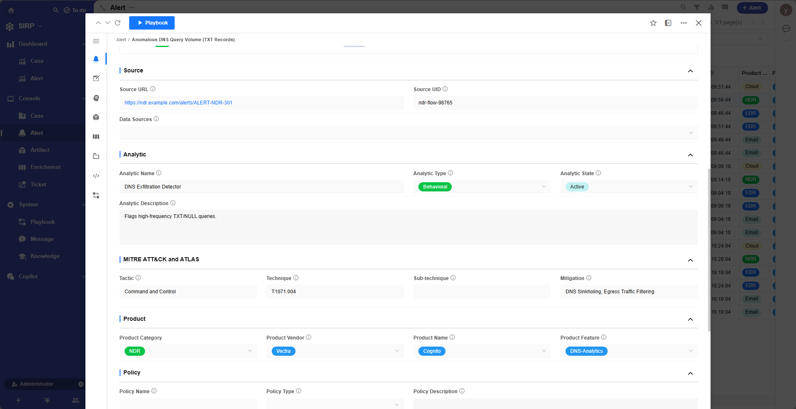
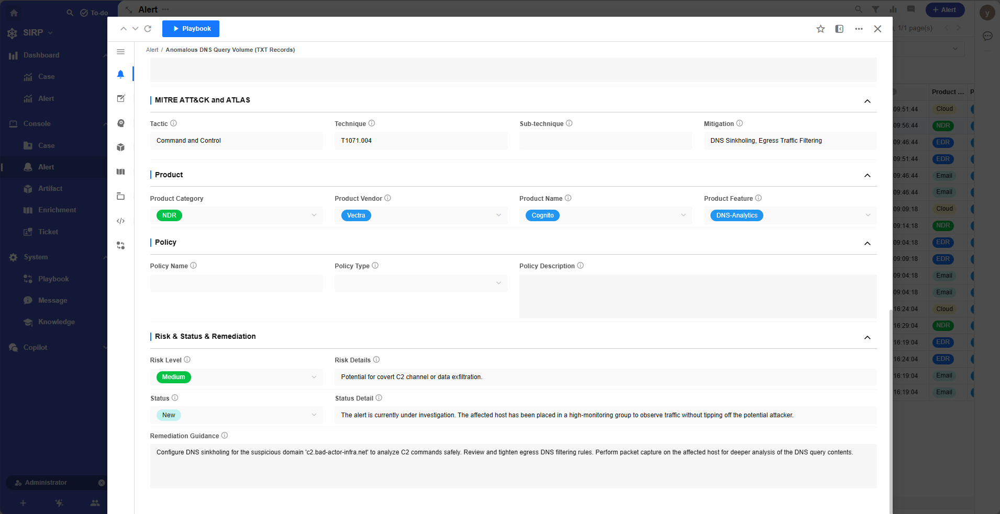

# Alert

- Centralized display of all alert records.
- All fields in alerts are read-only by default and cannot be edited.
- Analysts do not modify alert data; they only conduct investigations and response work based on alert data.

## View

Supports multiple filtering and sorting functions.

## Detail

> Alert Operations Panel

## Artifact

List of artifacts related to the alert.

## AI

AI analysis results generated based on alert content.

## Case

Cases associated with the alert.

## Raw Log

Original log content of the alert. JSON format.

## Playbook

Playbook execution history related to the alert.

## System

System fields of the alert.
