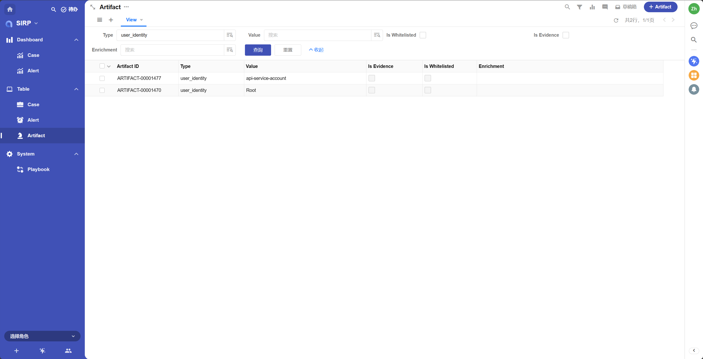
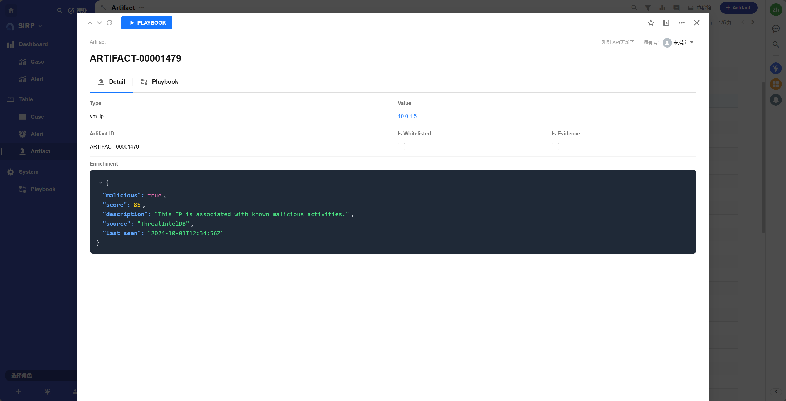

# Artifact

- An Artifact refers to specific data items or evidence related to a security incident, used to support investigation and response efforts.
- Artifacts can include various types of data, such as IP addresses, domain names, file hashes, URLs, email addresses, etc.
- Artifacts are mounted on Alerts to help analyze and investigate security incidents.
- Operations such as querying, responding, and enriching are typically performed based on Artifacts, for example, querying the owner information of a hostname, querying threat intelligence for a file hash, or blocking an IP address.

## View

Supports various filtering and sorting functions.

## Detail

- Type

Artifact type, such as ip, domain, hash, url, mail_from, etc.

- Value

The specific value of the Artifact, such as a specific IP address, domain name, etc.

- Artifact ID

Automatically generated unique Artifact number. Used only for readability display, not as a unique identifier.

- Is Whitelisted

Whether it is in the whitelist.

- Is Evidence

Whether it is used as evidence for investigation.

- Enrichment

Stores and displays enrichment information in JSON format.

## Playbook

List of Playbooks associated with the Artifact.

