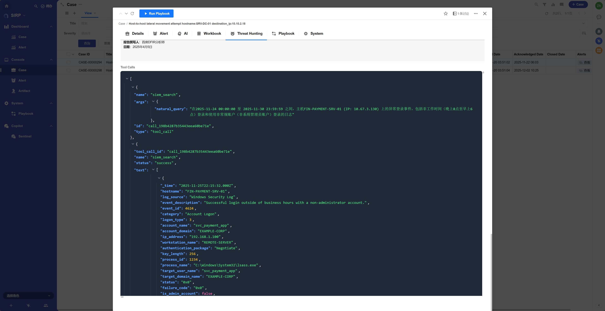

# Case

- Provides a centralized view for incident response personnel to manage and track the handling process of security events.
- Users can assign and update security tickets, ensuring that each event is handled promptly and effectively.

## View

- Supports multiple filtering and sorting functions.

## Detail

> Case Operations Panel - Shows Case basic information

## Enrichment

> All Enrichment records associated with the Case. Supports clicking on Enrichment records to view details

## Alert

> All alerts associated with the Case. Supports clicking on Alert records to view alert details

## AI

> Displays the analysis results of AI Agent

## Workbook

> Operations manual for Case handling, guiding analysts to complete investigation and response work, supports Markdown format.
>
> Workbook can use [] checkbox options and other methods, making it convenient for analysts to complete tasks step by step.

## Threat Hunting

> Report output from Threat Hunting Agent

> Tool invocation records of Threat Hunting Agent

## Playbook

> Automated playbook execution records associated with the Case.

## System

> Internal system fields for system use only.

- Detect Time

Detection time

- Acknowledge Time

Acknowledgment time

- Respond Time

Response time

- Deduplication Key

Alert aggregation keyword, used to aggregate similar alerts into the same Case.

## Operation Log

You can view the change history of a Case for audit and tracking purposes.

## War Room

You can view and participate in discussions related to the Case, collaborate with the team to handle it, and it can also be used as a war room for the Case.

## Execute Playbook

> For Playbook development, refer to [Playbook Development Guide](../../../asp/PLAYBOOKS/development/)

- Open the detail page and click the `Run Playbook` button in the upper left corner.

- Select the Playbook to execute and click the `Confirm` button.

- The initial task status is `Pending`, waiting for scheduling execution.

- During task execution, the status is `Running`.

- After task execution is complete, the status is `Success` or `Failed`. Click on the task record to view execution details.

