# Case

- 为应急响应人员提供了一个集中的视图，用于管理和跟踪安全事件的处理过程。
- 用户可以分配和更新安全工单，确保每个事件都得到及时和有效的处理。

## View

- 支持多种筛选和排序功能.

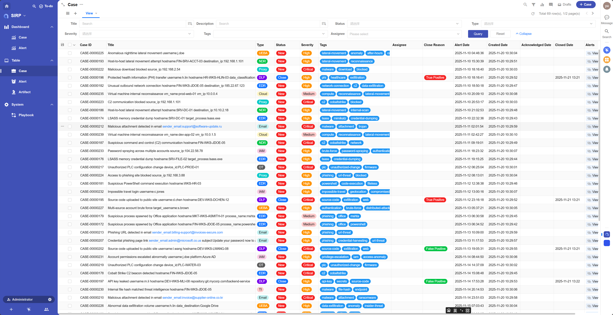

## Detail

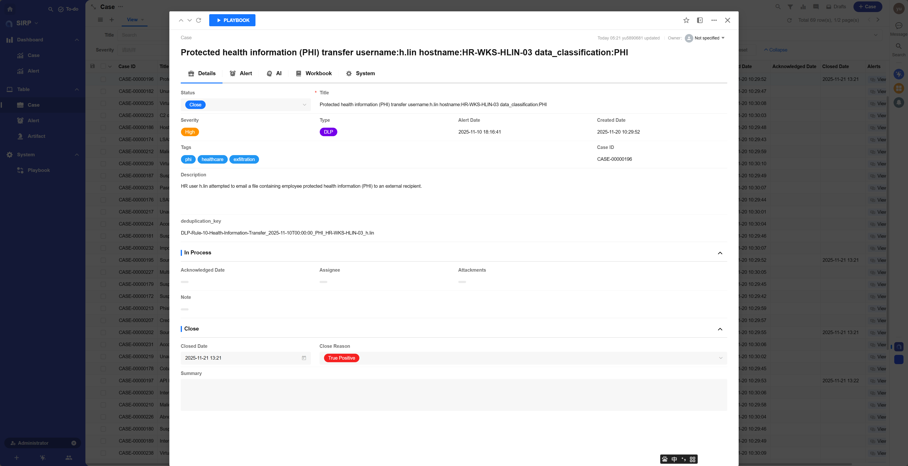
> Case 操作面板

- Status

工单状态,分为 `New` `In Progress` `Closed`三种状态. 初始为 `New` 状态.
当分析员手动将状态更新为 `In Progress` 时,表示工单正在处理中, 此时 `Acknowledged Date` `Assignee` `Attachments` `Note` 可编辑.
当分析员手动将状态更新为 `Closed` 时,表示工单已处理完成, 此时 `Close Date` `Close Reason` `Summary` 可编辑.

- Title

工单标题,简要描述工单内容

- Severity

工单严重性等级,分为 `Low` `Medium` `High` `Critical` 四个等级.

- Type

工单类型,分为 `NDR` `EDR` `DLP` 等等类型.

- Alert Date

Case 关联告警中最早的时间.可用于统计 MTTD.

- Created Date

Case 创建时间.可用于统计 MTTD.

- Tags

Case 标签,用于对工单进行分类和标记.可用于搜索和过滤.

- Case ID

自动生成的唯一工单编号.只用于可读性显示,不作为唯一标识.

- Description

Case 的详细描述,包括事件背景,影响范围等信息.支持 Markdown 格式.

- Acknowledged Date

Case 被分析员认领的时间.可用于统计 MTTA.

- Assignee

当前的处理人.可用于分配和跟踪工单处理进度.

- Attachments

Case 相关的附件,如日志文件,截图等.支持多种文件格式.分析人员可将相关证据上传至此.

- Note

Case 处理过程中的备注信息.分析人员可记录调查过程,发现的线索等内容. 支持 Markdown 格式.

- Close Date

Case 关闭时间.可用于统计 MTTR.

- Close Reason

Case 关闭原因.分析人员可选择预定义的关闭原因,如 `True Positive` `False Positive` `Ignore` `Duplicate` .

- Summary

Case 处理总结.分析人员可记录最终的调查结果,采取的响应措施等内容. 支持 Markdown 格式.

## Alert

> 与 Case 关联的所有告警, 支持点击 Alert 记录查看告警详情

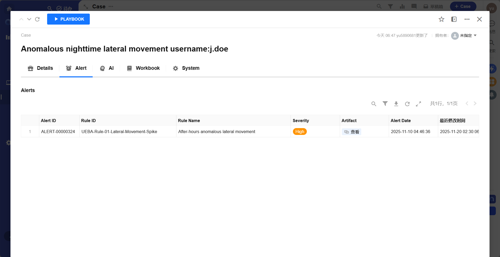

## AI

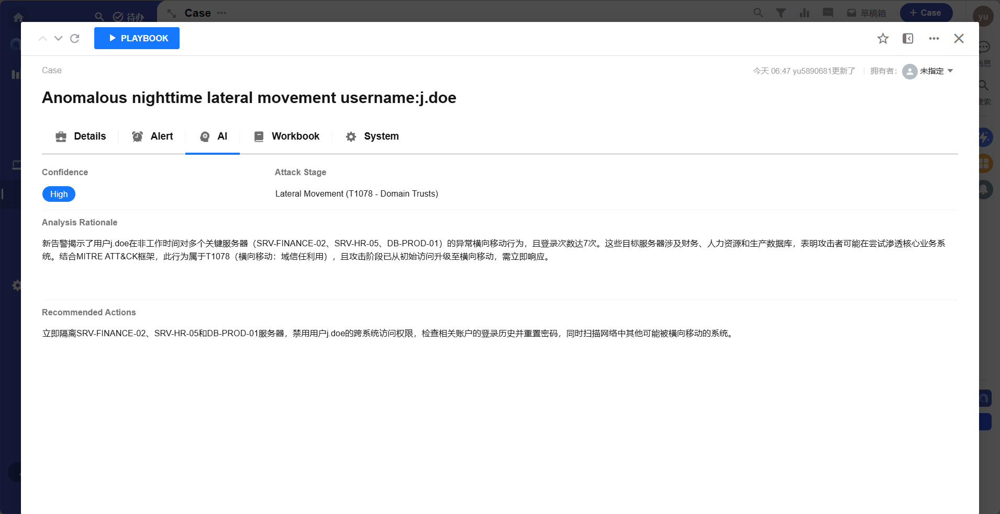

> 展示 AI Agent 的分析结果

- Confidence

AI 对分析结果的置信度评分, `Low` `Medium` `High` 三个等级.

- Attack Stage

MITRE ATT&CK 框架中的攻击阶段,如 `Initial Access` `Execution` `Persistence` 等等.

- Analysis Rationale

AI Agent 输出的分析依据

- Recommended Actions

AI Agent 推荐的响应措施

## Workbook

> Case 处理的操作手册,指导分析人员完成调查与响应工作,支持 Markdown 格式.
>
> Workbook 中可以使用 [] 等选项方式,方便分析人员逐步完成任务.

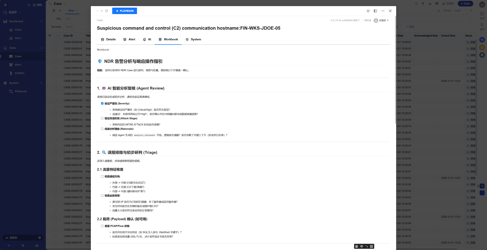

## Playbook

> 与 Case 关联的自动化剧本记录.

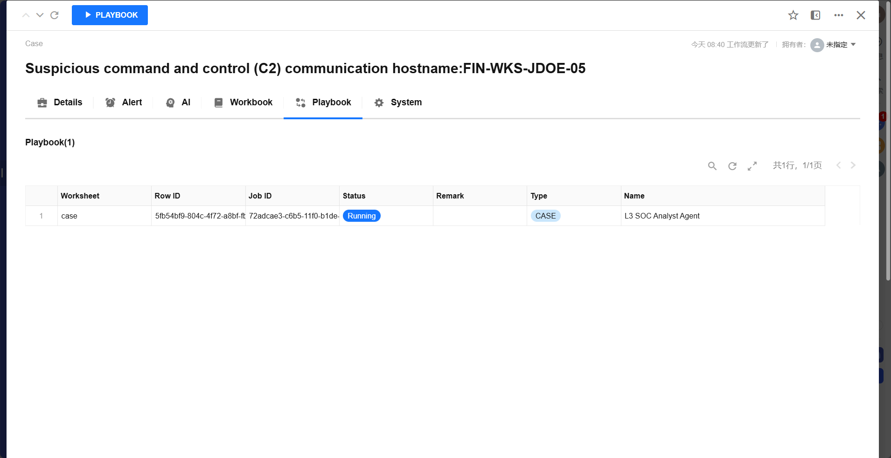

## System

> 内部系统字段,仅供系统使用.

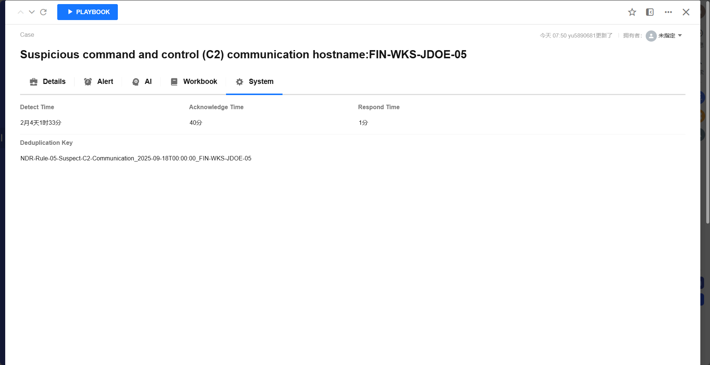

- Detect Time

检测用时

- Acknowledge Time

认领用时

- Respond Time

响应用时

- Deduplication Key

告警聚合关键字,用于将相似告警聚合为同一 Case.

## 操作日志

可以查看 Case 的变更记录,用于审计和追踪.

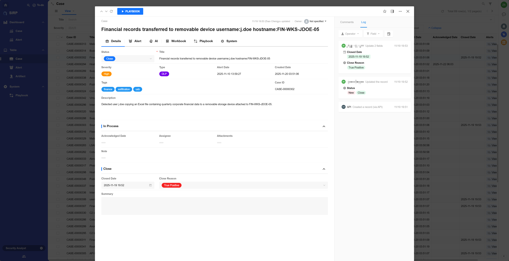

## 作战室

可以查看和参与 Case 相关的讨论,团队协作处理,也可作为该 Case 的作战室使用.

## 执行 Playbook

> Playbook 开发可参考 [Playbook 开发指南](../../../asf/PLAYBOOKS/development/)

- 打开详情页,点击左上角的 `Run Playbook` 按钮.

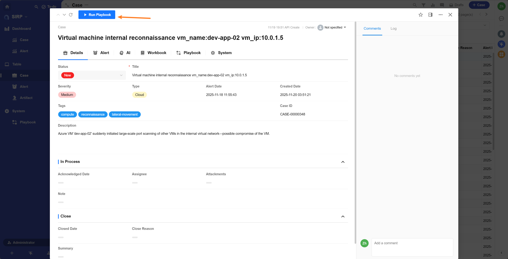

- 选择需要执行的 Playbook,点击 `确认` 按钮.

- 任务初始状态为 `Pending` ,等待调度执行.

- 任务执行过程中,状态为 `Running`.

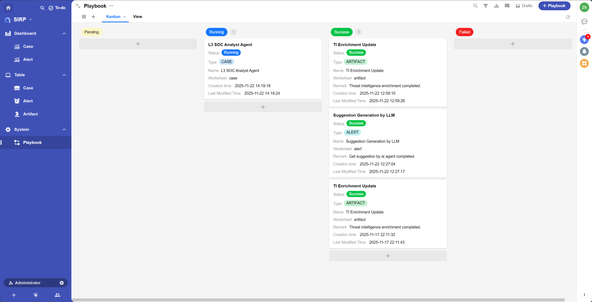

- 任务执行完成后,状态为 `Success` 或 `Failed`,点击任务记录可查看执行详情.

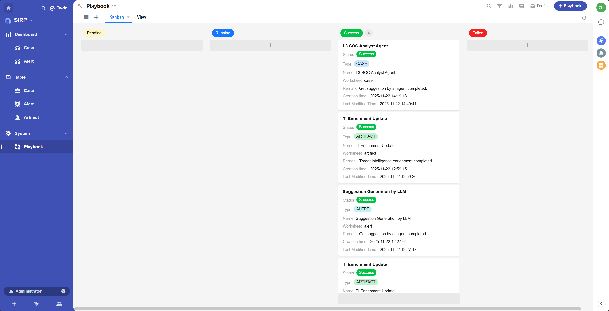