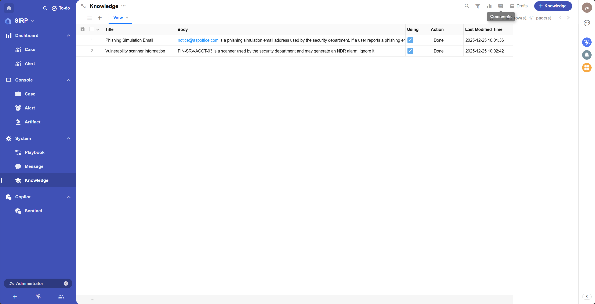

# Knowledge

Stores and manages the SOC team's knowledge base, supports Markdown format, and can be called by agents.

## View

## Detail

- Title

Knowledge item title.

- Body

Knowledge item content.

- Using

Whether the knowledge item is in use (whether it can be called by the Agent).

- Action

Knowledge base actions.

When a knowledge item is set to `Store`, the backend will automatically store it in the "sirp_knowledge" collection. After completion, the item is marked as `Using`, and the Action is reset to `Done`.

When a knowledge item is set to `Remove`, the backend will automatically delete it from the "sirp_knowledge" collection. After completion, the item is marked as not in use, and the Action is reset to `Done`.
