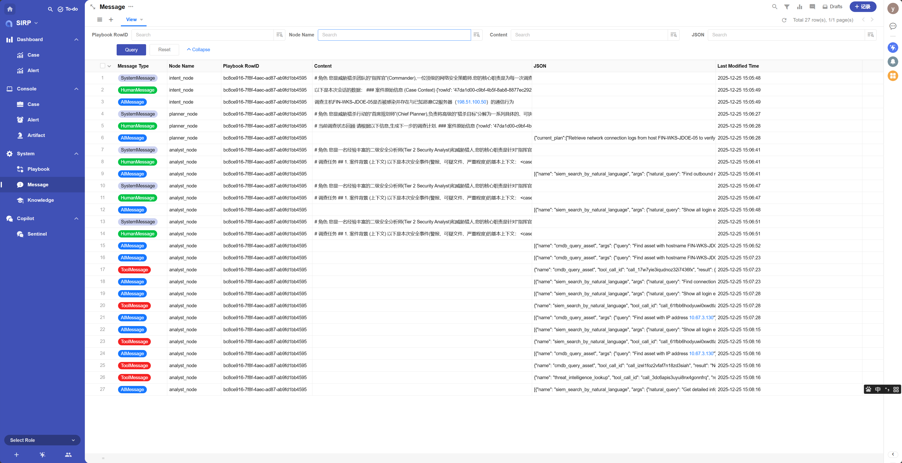

# Message

Agent runtime Message list.

## View

## Detail

- Message Type

Four types: `SystemMessage`, `HumanMessage`, `AIMessage`, `ToolMessage`.

- Node Name

Langgraph node name.

- Playbook RowID

Executed Playbook ID.

- Content

Message content.

- JSON

Message content in JSON format. Used when adapting Function Calling.

