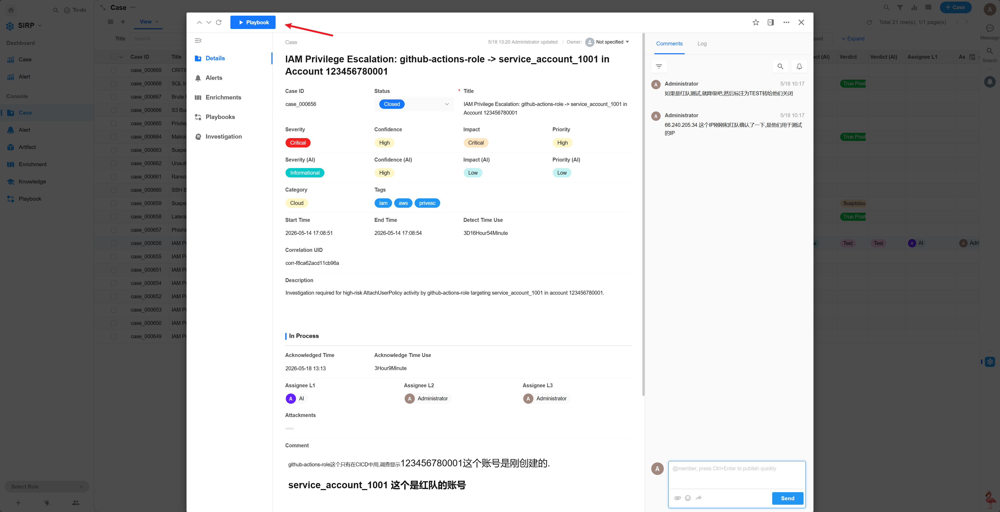
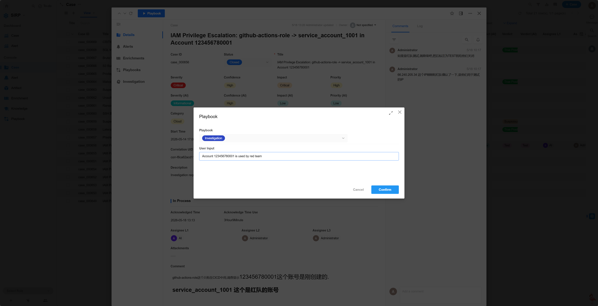
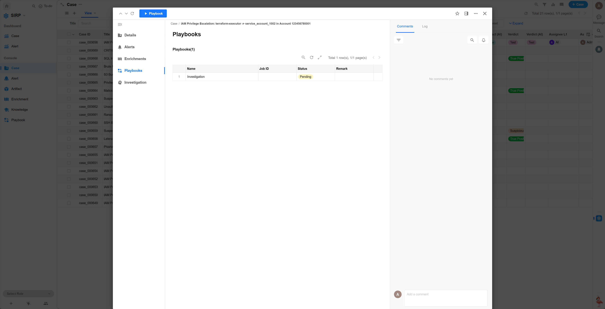
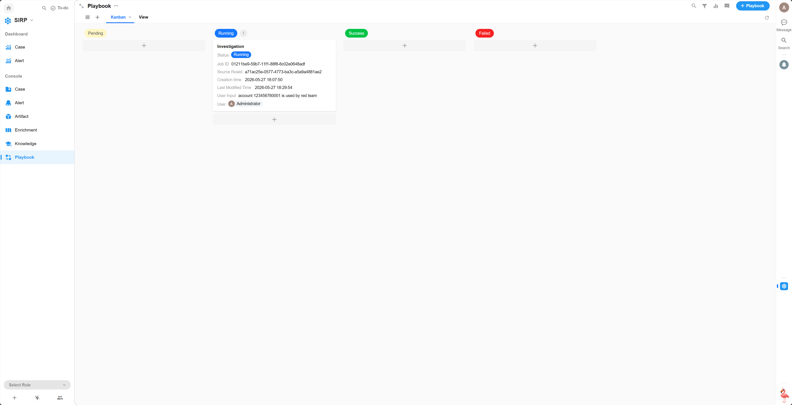

# Playbook

Automated playbook records associated with Alerts, Cases, and Artifacts.

## Kanban / View

## Detail

- Select a Case to open the detail page, then click the `Playbook` button in the upper left corner.
  

- Select the Playbook to execute and click the `Confirm` button. If there are additional requirements, you can describe them in natural language in the User Input field, which the LLM will reference during analysis.
  
  

- The task initial status is `Pending`, waiting for scheduled execution.
  
  

- During task execution, the status is `Running`.
  

- After task execution completes, the status is `Success` or `Failed`. Click the task record to view execution details.
  
