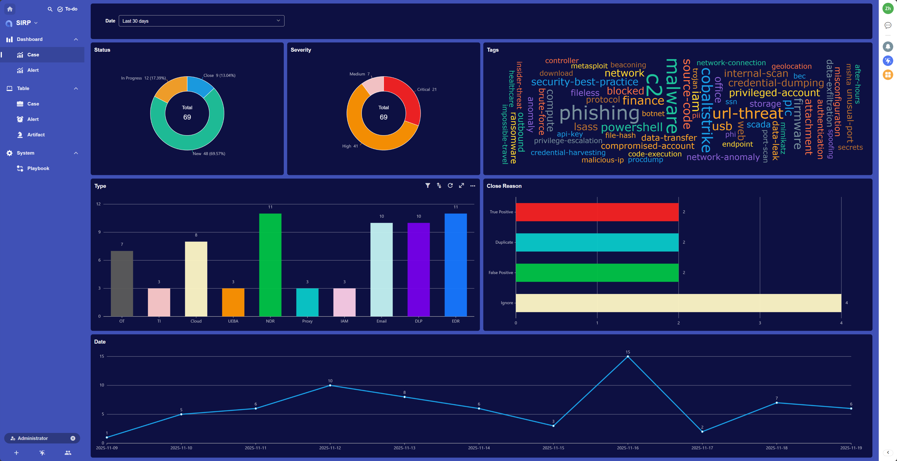
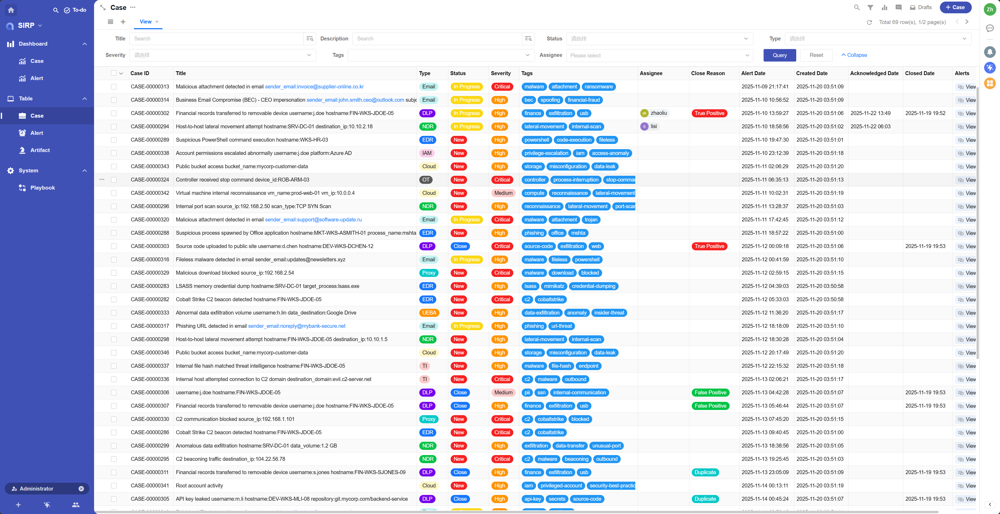
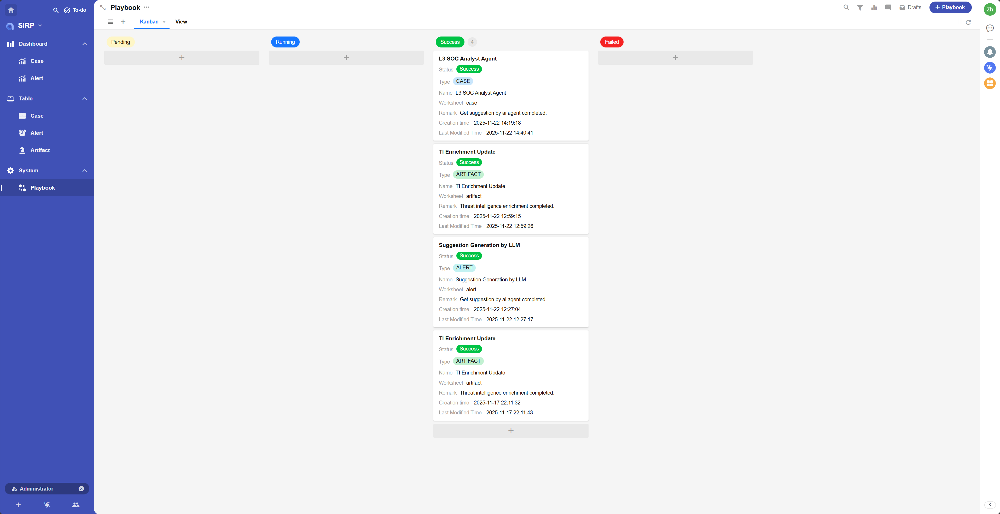

# 欢迎使用 SIRP

- SIRP 是 ASF 中内置的安全编排与响应平台 (Security Incident Response Platform)
- ASF 作为后台框架, 提供强大的自动化编排与 AI 驱动能力, 而 SIRP 则作为前端应用, 通过直观的用户界面帮助安全团队高效管理和响应安全事件。
- SIRP 的设计思路和数据模型参考了主流的 SOAR 平台 (Splunk SOAR, Swimlane SOAR 等)。
- SIRP 基于 Nocoly 平台构建, 利用其 APaas 特性实现灵活的定制和扩展。

