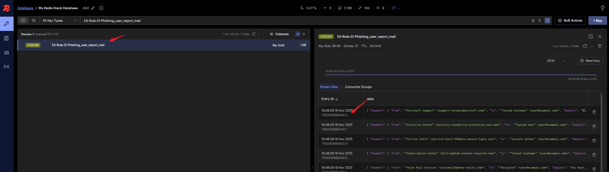

# 总览

- `alert_preprocess_node` Node 展示如何从Redis Stream队列中读取告警并进行简单数据处理.
- `alert_analyze_node` Node 展示如何加载 system prompt,构建few shot,格式化输出结果.
- `alert_output_node` Node 展示自定义聚合规则使用,如何将分析结果发送至 SIRP.

# 开发调试

## 导入测试告警

ASF提供的样例模块都包含用于测试的告警数据,位于 `DATA/{模块名}/mock_alert.py`,执行该脚本即可将测试告警数据导入Redis Stream中.

## 单模块 & 单告警调试

- 模块开发过程中开发人员经常需要针对某条特定告警进行调试.
- ASF框架可以单独调试模块,无需启动整个框架.代码可参考该模块```if __name__ == "__main__":```部分.

- 开发人员只需要在Redis Insight中找到模块对应的Stream队列,获取某条告警的ID.



- 然后将ID赋值给`module.debug_message_id`变量并运行模块脚本调试该告警.


## 告警聚合 (SIRP)

TODO