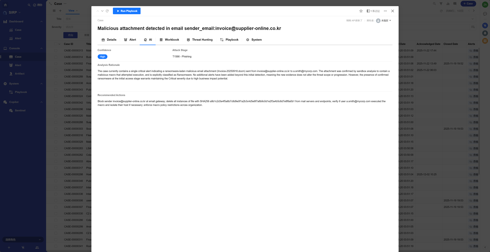

# SOC L3 分析师智能体

## 注册名称

```
L3 SOC Analyst Agent
```

## 剧本文件

```
PLAYBOOK/Case_L3_SOC_Analyst_Agent.py
```

## 功能介绍

- 调用 Agent 分析安全工单,生成 Case 的 AI 相关字段,辅助 L3 SOC 分析员进行威胁狩猎与响应.
- 汇总分析 Case 生成 Case 的 Severity/Confidence/Attack Stage/Analysis Rationale/Recommended Actions.

## 执行效果



## 开发指南

- 该剧本代码可用于开发模块,每次 Case 挂载新的告警时自动化分析.
