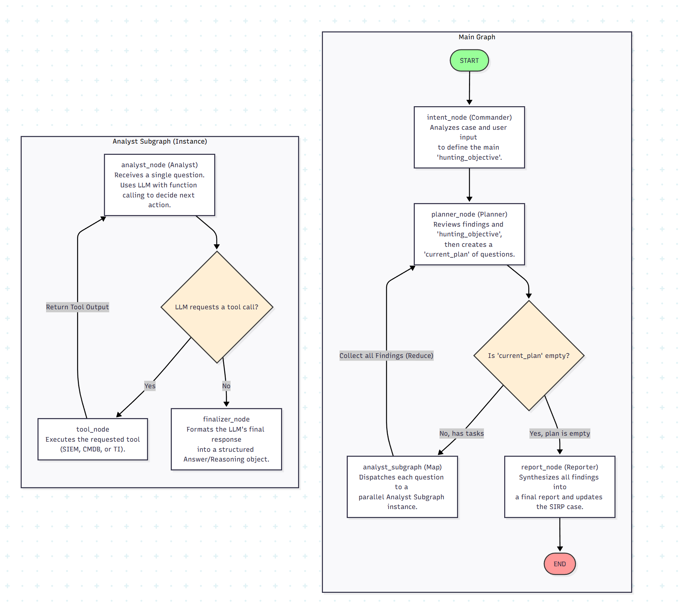
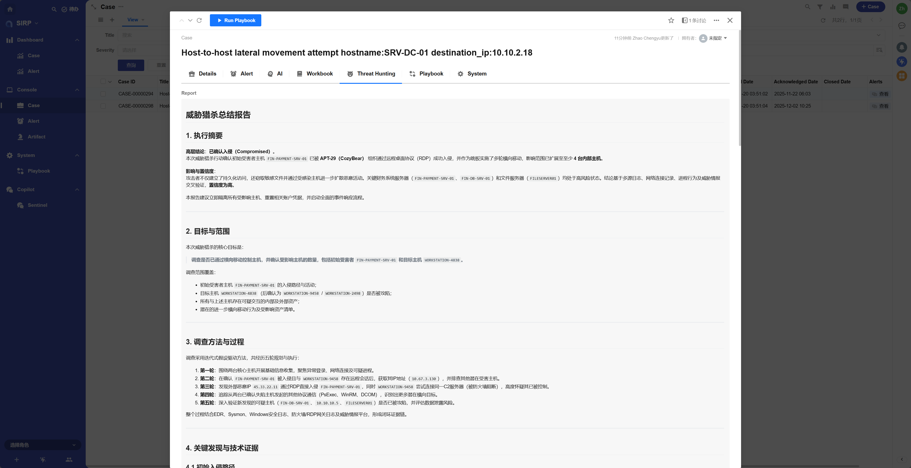

# 威胁狩猎能体

## 注册名称

```
Threat Hunting Agent
```

## 剧本文件

```
PLAYBOOK/Case_Threat_Hunting_Agent.py
```

## 功能介绍

通用的威胁狩猎智能体,根据 Case 的相关信息和用户意图,执行威胁狩猎任务,并输出威胁狩猎报告.



## 执行效果




## 开发指南

- 外部工具(SIEM/CMDB/TI平台等)的数据查询和操作,参考`analyst_node`节点绑定工具部分

```python
base_llm = llm_api.get_model(tag=["powerful", "function_calling"])
llm_with_tools = base_llm.bind_tools([SIEMAgent.search, CMDBAgent.query_asset, TIAgent.lookup])
response = llm_with_tools.invoke(messages)
```

- 当前智能体为通用型,可以针对任意类型的Case进行威胁狩猎,如果需要针对特定类型的Case进行定制化威胁狩猎,可以修改`Planner_System.md`文件,调整智能体的规划思路和执行步骤.
- 如果需要固定格式的报告,可修改`Report_System.md`