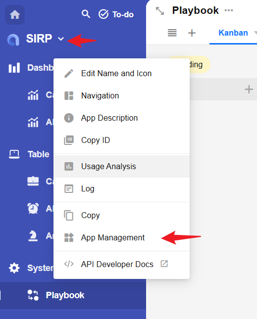

# SIRP 剧本开发指南

Alert_Suggestion_Gen_By_LLM 是 SIRP 剧本的模板样例,以此剧本介绍如何开发 SIRP 剧本.

## 准备

- 首先确认剧本用于何种数据类型(Alert/Case/Artifact等)
- 新建或拷贝并重命名已有剧本文件

## 获取输入参数

- 每个剧本与一类数据类型绑定,剧本执行时会传入该数据类型对应的worksheet和rowId(可以理解为数据库表和主键ID),剧本执行过程中可以通过接口获取一条完整的数据.
- 通过接口还可以获取数据记录的关联数据,例如通过 Case 的 rowId 获取该 Case 关联的 Alerts 列表.Alerts 列表中每一条 Alert 也可以通过接口获取 Artifact 列表.
- 实现代码可以参考`preprocess_node`节点代码
- **此种方式的好处是用户执行剧本时无需输入参数,剧本可以通过接口获取所需的所有数据**
- 获取worksheet/rowId/user/playbook_rowid的代码

```python
self.param("worksheet")
self.param("rowid")
self.param("user")
self.param("playbook_rowid")
```

## 更新任务结果并发送通知

- SIRP 每次执行剧本都会在 Playbook 的 worksheet中创建一条记录


- 每次执行完成后建议通过如下代码更新任务结果

```python
from PLUGINS.SIRP.sirpapi import Playbook as SIRPPlaybook
SIRPPlaybook.update_status_and_remark(self.param("playbook_rowid"), "Success", "Get suggestion by ai agent completed.")  # Success/Failed 
```

- 推荐在执行完成后通过 Notice.send 向执行脚本的用户发送通知

```python
from PLUGINS.SIRP.sirpapi import Notice
Notice.send(self.param("user"), "Alert_Suggestion_Gen_By_LLM output_node Finish", f"rowid：{self.param('rowid')}")
```


## SIRP 注册

- 应用于 SIRP 的剧本需要一个分类标签(CASE/ALERT/ARTIFACT)和人类可读的名字,便于使用人员在 SIRP 界面中选择剧本执行.

- 剧本中使用 TYPE 和 NAME 两个类变量进行注册.

```python

class Playbook(LanggraphPlaybook):
    RUN_AS_JOB = True  # 异步模块
    TYPE = "ALERT"  # 分类标签
    NAME = "Suggestion Generation by LLM"  # 剧本名称
```

- 剧本编写完成后,需要在 SIRP 中将剧本名称添加到对应的选项集中.`playbook_artifact` `playbook_alert` `playbook_case` 分别对应Artifact/Alert/Case类型剧本.




- 添加完成后,在 SIRP 打开对应的记录,点击 `Playbook` 按钮即可选择新添加的剧本执行.


> 选择一条 Alert 记录


> 选择剧本并执行

- 剧本任务执行状态可以在 `Playbook` 中查看


## 剧本调试

- 每个剧本文件是一个单独的 `Playbook` 类,可以直接执行进行开发调试
- 例如 `Alert_Suggestion_Gen_By_LLM` 剧本应用于 `Alert` 记录

```python
if __name__ == "__main__":
    params_debug = {'rowid': '55639caf-c648-4130-bc9f-8d38becfe20f', 'worksheet': 'alert'}
    module = Playbook()
    module._params = params_debug
    module.run()
```

- 其中 `rowid` 可以通过如下图方法获取

