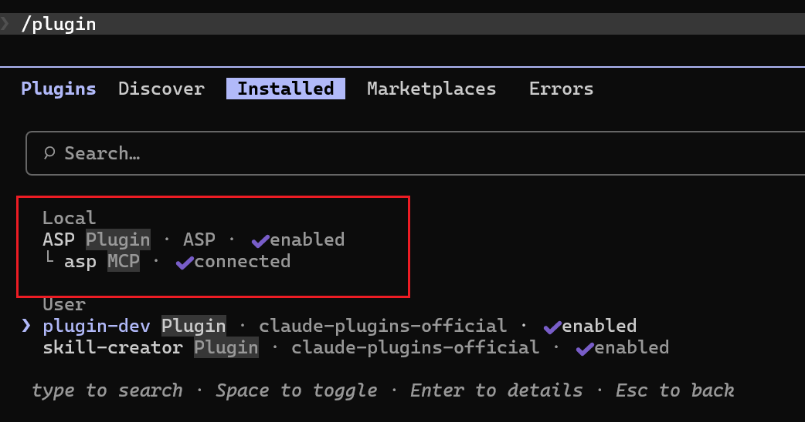

# Claude Code 插件

## 功能列表

- asp-case-investigator / asp-artifact-investigator / asp-threat-hunting 三个 agent
- alert / artifact / case / enrichment / knowledge / module-creator / playbook / siem-index-yaml / siem-search / ti / ticket 十一个 skill
- 默认连接 ASP MCP 服务器

## 配置方法

- 首先启动 ASP 的 MCP 服务,获取 MCP SSE URL [文档链接](../MCP/)
- 将 url 设置到环境变量 ASP_MCP_SSE_URL

PowerShell:
```powershell
$env:ASP_MCP_SSE_URL = "http://your_server_ip:7000/XXXXXXXXXXXXX/sse"
```

Bash:
```bash
export ASP_MCP_SSE_URL="http://your_server_ip:7000/XXXXXXXXXXXXX/sse"
```

- 启动 Claude Code , 添加 https://github.com/FunnyWolf/agentic-soc-platform marketplace, 安装 asp plugin
- 启动 Claude Code,注册 marketplace

```
/plugin marketplace add FunnyWolf/agentic-soc-platform
```

- 从 marketplace 中安装 plugin

```
/plugin install ASP@agentic-soc-platform 
```




## 调用 Skill / Agent

