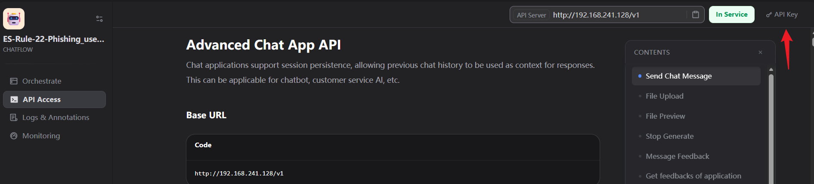

# Dify 插件

## 配置方法

- 将配置文件 agentic-soc-platform/PLUGINS/Dify/CONFIG.example.py 重命名为 CONFIG.py 使配置生效
- DIFY_BASE_URL获取方法


- DIFY_API_KEY 是根据每个应用名进行配置




## 命名规则

通常建议Dify中的应用名称与ASF中调用的Module/Playbook名称相同,ASF中可以使用如下代码快速调用对应的应用

```python
client = Dify()
# 直接通过module_name或playbook_name获取到对应的api_key
# api_key直接和Dify应用绑定
api_key = client.get_dify_api_key(self.module_name)
inputs = {
    "alert_raw": json.dumps(self.agent_state.alert_raw)
}

result = client.run_workflow(
    api_key=api_key,
    inputs=inputs,
    user=self.module_name
)
self.agent_state.analyze_result = result.get("analyze_result")
return
```
