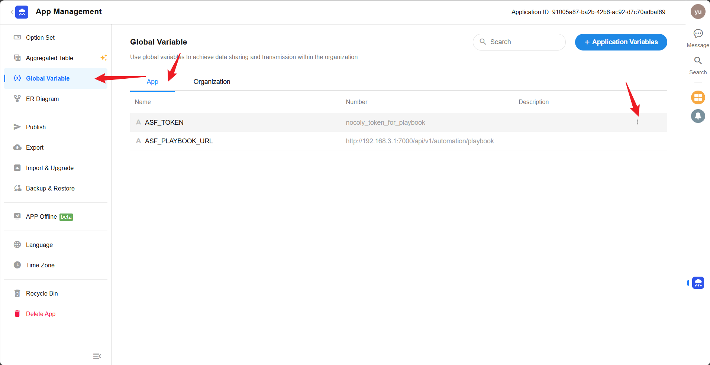

# SIRP 插件

## SIRP配置

> 用于ASF 的 REST API认证,与 agentic-soc-platform/PLUGINS/SIRP/CONFIG.py 文件中 ASF_TOKEN 保持一致

> 用于调用ASF Playbook 接口,请根据实际配置修改IP

## 插件配置

- 将配置文件 agentic-soc-platform/PLUGINS/SIRP/CONFIG.example.py 重命名为 CONFIG.py 使配置生效
- SIRP_URL为 SIRP 平台地址,如 http://192.168.241.128:8880
- SIRP_APPKEY 及 SIRP_SIGN

> AppKey对应SIRP_APPKEY,Sign对应SIRP_SIGN

- SIRP_NOTICE_WEBHOOK

> 将通知Webhook地址填写到 SIRP_NOTICE_WEBHOOK
