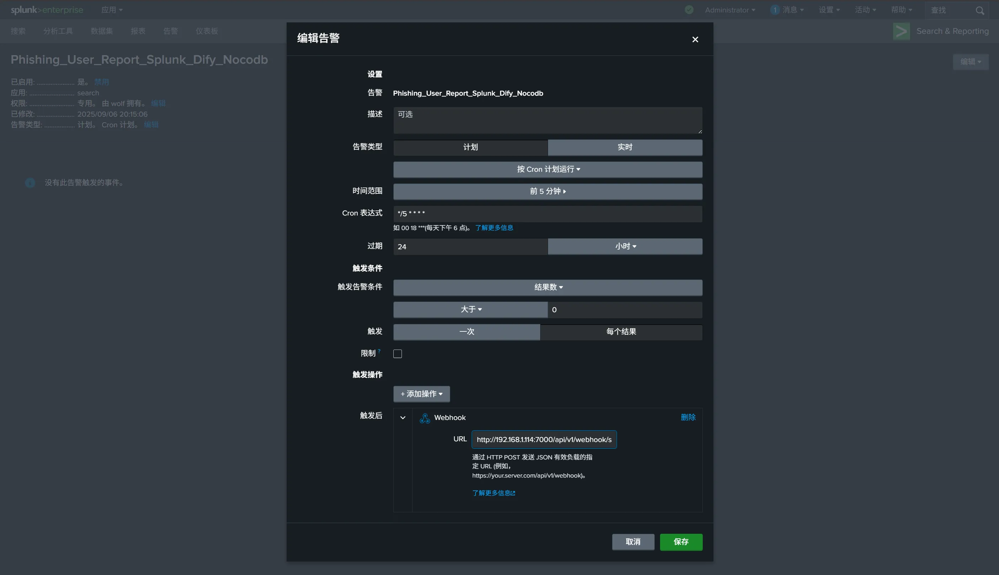
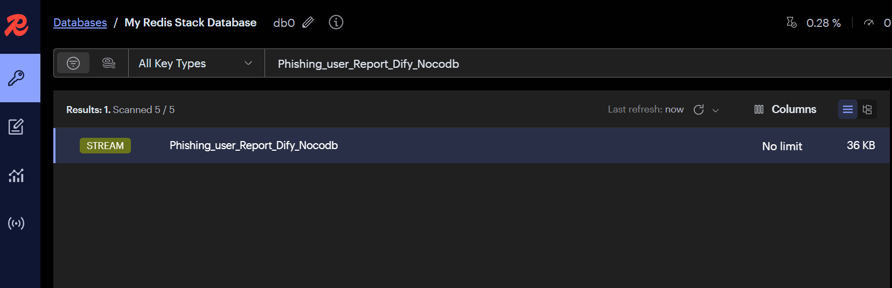
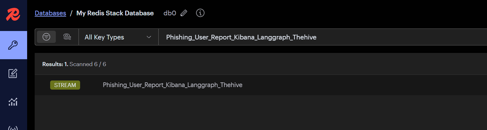

# SIEM 集成

## Webhook Forwarder

- ASP 内置 Webhook 接收节点,将 SIEM Webhook 发送的告警转发到 Redis Stack 对应的 Stream
- Forwarder 会自动解析 Kibana/Splunk 中的告警名称,并根据告警名在 Redis Stack 创建同名的 Stream
- Forwarder 实现代码 `Forwarder/views.py`
- Forwarder 的URL格式为 `http://<ASF_SERVER_IP>:<ASF_SERVER_PORT>/api/v1/webhook/<SIEM_NAME>`, 其中 `<SIEM_NAME>` 支持 `kibana` 和 `splunk`
- 为了便于集成, Forwarder Webhook 不需要身份认证,可通过防火墙进行访问控制

## Splunk 集成

- SOC 团队首先需要根据自身的需求将安全设备或相关的系统日志集成到 Splunk,并根据业务要求创建告警.

  

- 触发需要选择`每个结果`,确保获取到所有告警.
- Webhook 链接为 `http://<ASF_SERVER_IP>:<ASF_SERVER_PORT>/api/v1/webhook/splunk`
- Forwarder 会自动将告警转发到 Redis Stack 中对应的 Stream,Stream 名称为告警名称.
- 例如上图的告警会转发到Redis Stream 的 `Phishing_user_Report_Dify_Nocodb` 队列



- 在`MODULE`创建`Phishing_user_Report_Dify_Nocodb.py`模块,即可处理该告警.
- Splunk 告警的原始内容通常使用`_raw` 字段存储,Forwarder 会将该字段的内容作为告警的主要信息进行处理.如果在模块中解析告警时通常使用如下代码:

```python
alert = self.read_message()
if alert is None:
    return

# Example: For Splunk webhooks
alert = json.loads(alert["_raw"])
```

## Kibana (ELK) 集成

- SOC 团队首先需要根据自身的需求将安全设备或相关的系统日志集成到 ELK,并根据业务要求创建 Rule.
- 创建 `Webhook Connectors`,`Authentication` 为 `None`,添加 `header` `Content-Type: application/json`
- Webhook URL 为 `http://<ASF_SERVER_IP>:<ASF_SERVER_PORT>/api/v1/webhook/kibana`

  

- Kibana 中每个 Rule 中的 `Action` 选择上面创建的 `Webhook Connectors`.
- `Message` 内容使用如下 JSON 模板 (context.hits 包含告警过滤出的 documents 即原始日志)

```
{
  "rule":{
    "name":"{{rule.name}}"
  },
  "context":{
    "hits":[{{{context.hits}}}]
  }
}
```

- `Details` 中 `Rule name` 会作为告警名称, Forwarder 会将告警转发到 Redis Stack 中对应的 Stream,Stream 名称为告警名称.


- 例如上图的告警会转发到Redis Stream 的 `Phishing_User_Report_Kibana_Langgraph_Thehive` 队列



- 在 `MODULE` 创建 `Phishing_User_Report_Kibana_Langgraph_Thehive.py` 模块,即可处理该告警.

