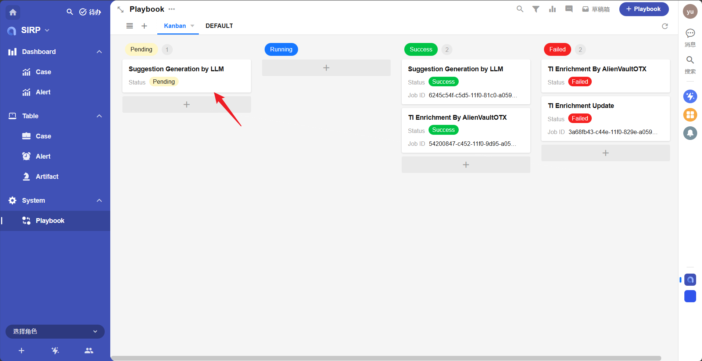

# 开发指南

剧本（Playbook）用于执行**用户触发**的自动化任务，例如：

- 调用 LLM 分析 Case 并生成报告（[Investigation](../Investigation/index.md)）
- 分析已关闭 Case 的处理过程和结果，生成 Knowledge（[Knowledge Extraction](../Knowledge_Extraction/index.md)）
- 为 Case 关联的所有 Artifact 添加威胁情报富化（[Threat Intelligence Enrichment](../Threat_Intelligence_Enrichment/index.md)）

[Investigation](../Investigation/index.md) 可作为样例，展示剧本中关键 API 的用法。

## 注册剧本

- 剧本仅作用于 Case，只有 Case 可以运行剧本
- 在 `PLAYBOOKS` 目录下创建脚本文件
- 类名必须为 `Playbook`,继承自 `BasePlaybook` 或 `LanggraphPlaybook`
- 类中须包含 `NAME = "XXX"`,作为 SIRP 中的注册名称
- 实现 `run` 方法，框架会自动调用
- **推荐做法：复制现有脚本，按需修改**

## 获取输入参数

- `self.param_source_row_id` — 触发剧本的 Case row_id，可用于调用 Case 相关接口（如获取关联的 Alert 列表，进而获取每个 Alert 的 Artifact 列表）
- `self.param_user_input` — 用户执行时的附加输入（可选）
- 剧本执行过程中，可通过 API 更新 Case/Alert/Artifact

## 更新任务结果

执行完成后，通过以下代码更新任务状态：

```python
self.update_playbook_status(PlaybookJobStatus.SUCCESS, "Case Investigation Success.")  # SUCCESS/FAILED
```

## SIRP 注册

剧本需要在 SIRP 中注册后，才能在界面中被选择执行。

将剧本的 `NAME` 值添加到 SIRP 的 `PLAYBOOK` 选项集中:




注册完成后，在 Case 详情页点击 `Playbook` 按钮即可选择执行。

## 剧本调试

每个剧本文件是独立的 `Playbook` 类，可直接运行进行调试。以 `Investigation` 为例：

```python
if __name__ == "__main__":
    import os, django
    os.environ.setdefault("DJANGO_SETTINGS_MODULE", "ASP.settings")
    django.setup()
    model = PlaybookModel(source_row_id='your_case_row_id_here')
    module = Playbook()
    module._playbook_model = model
    module.run()
```

其中 `source_row_id` 可在 SIRP 的 Case 详情页获取：


