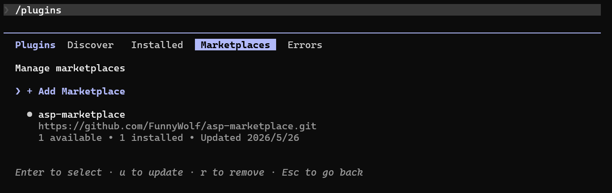

# Claude Code 插件

## 功能列表

- **3 个 Agent**
    - `asp-case-investigator` — 以 case 为主导的安全调查、分诊与证据评估
    - `asp-artifact-investigator` — 以 IOC/artifact 为主导的调查、威胁猎杀与范围判定
    - `asp-threat-hunting` — 主动威胁猎杀与假设驱动的安全调查

- **10 个 Skill**
    - `asp-alert` — 查看告警并进行分诊分析
    - `asp-artifact` — 按 IOC 查找 artifact
    - `asp-case` — 管理安全 case，包括审查、讨论、工作流与 AI 分析
    - `asp-enrichment` — 将结构化数据保存为 enrichment 并附加到 case/alert/artifact
    - `asp-knowledge` — Knowledge 记录的检索与维护，支持语义搜索
    - `asp-module-creator` — 为 SIEM rule 编写告警处理 Python 脚本
    - `asp-playbook` — 操作 playbook definition 与 playbook run，查看、执行或回溯
    - `asp-siem-index-yaml` — 新建或更新 SIEM 索引配置 YAML
    - `asp-siem-search` — 在 SIEM 中进行日志调查、事件检索与结构化分析
    - `asp-threat-intelligence` — 查询 IOC 的威胁情报，评估风险等级

- 连接 ASP MCP 服务器

## 配置方法

- 配置 [MCP 插件](../MCP/index.md), 获取 MCP SSE URL
- 将 url 设置到环境变量 ASP_MCP_SSE_URL

PowerShell:

```powershell
$env:ASP_MCP_SSE_URL = "http://your_server_ip:7001/XXXXXXXXXXXXX/sse"
```

Bash:

```bash
export ASP_MCP_SSE_URL="http://your_server_ip:7001/XXXXXXXXXXXXX/sse"
```

- 启动 Claude Code
- 注册  https://github.com/FunnyWolf/asp-marketplace marketplace

```
/plugin marketplace add FunnyWolf/asp-marketplace
```

- 从 marketplace 中安装 plugin

```
/plugin install asp-plugin@asp-marketplace
```




## 调用 Skill / Agent


## 补充说明

- ASP Plugin 在 Claude Code 启动时 MCP Tools / Agents / Skills 一共约占用 10.5k 的上下文


- 在使用时推荐将 Plugin 安装到 repo local,减少在使用 Claude Code 开发其他项目时的上下文占用.

