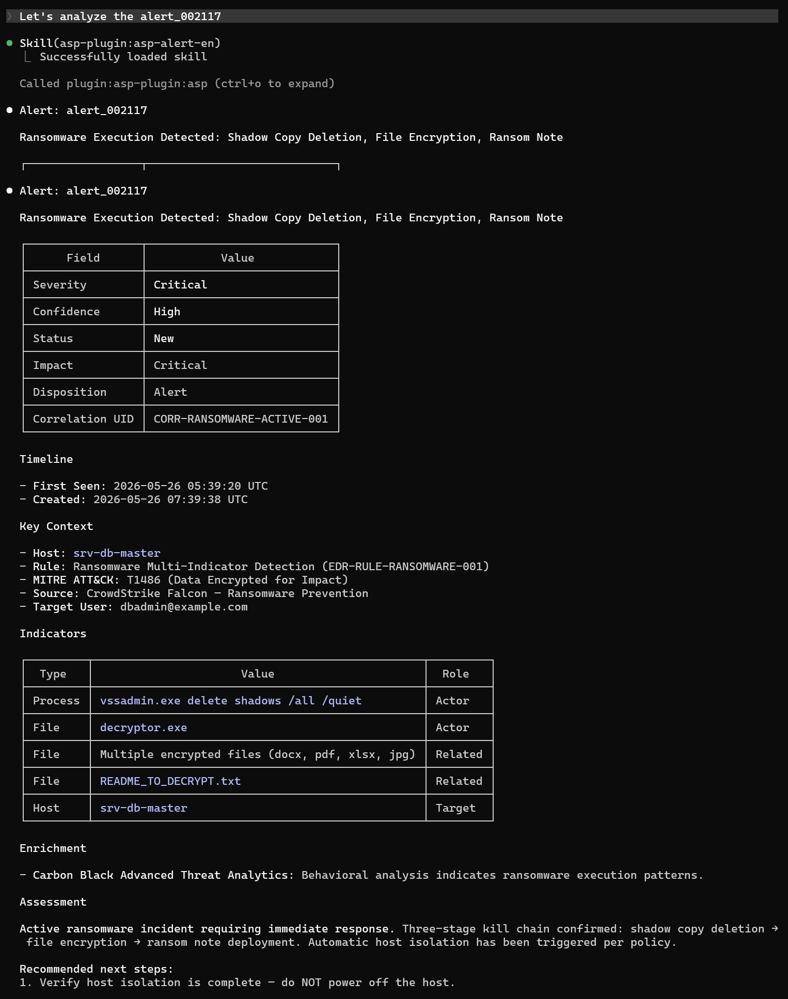

# Alert

查看和筛选 ASP 告警,用于分诊分析.

## 触发场景

- 查看某个告警详情
- 按状态/严重程度/置信度筛选告警
- 从 Case 关联的告警中定位关键线索

## 使用样例

## 输入

| 参数       | 说明                                            |
|----------|-----------------------------------------------|
| alert_id | 告警 ID,如 `alert_000001`                        |
| 过滤条件     | status, severity, confidence, correlation_uid |

## 输出

告警详情: ID、标题、严重程度、状态、置信度、关联规则、时间线、MITRE ATT&CK 映射.

## 依赖

调用 MCP 工具: `list_alerts`. 保存分析需配合 `asp-enrichment-en/zh`.
