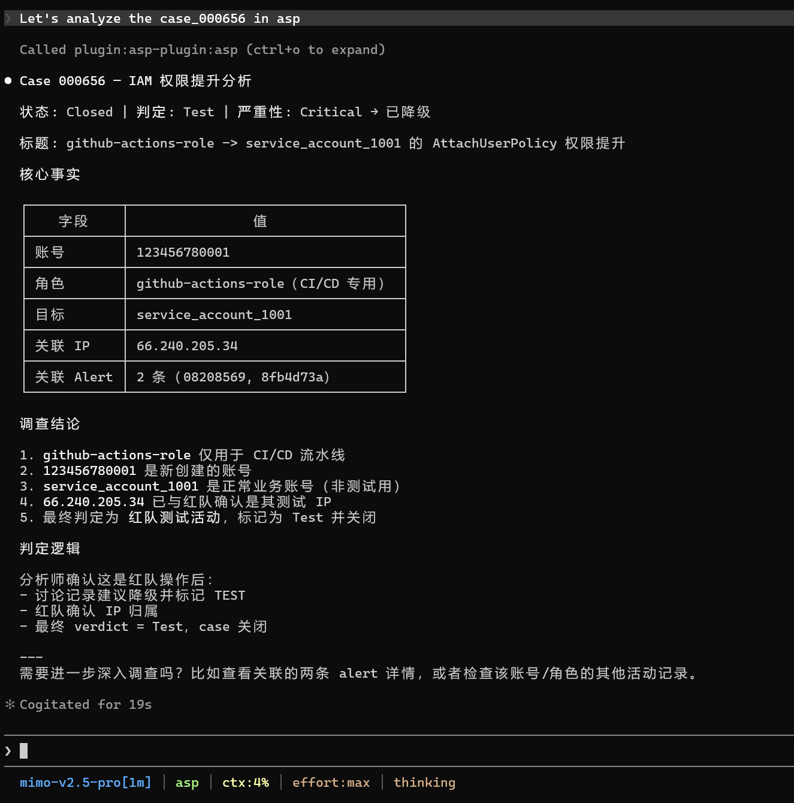
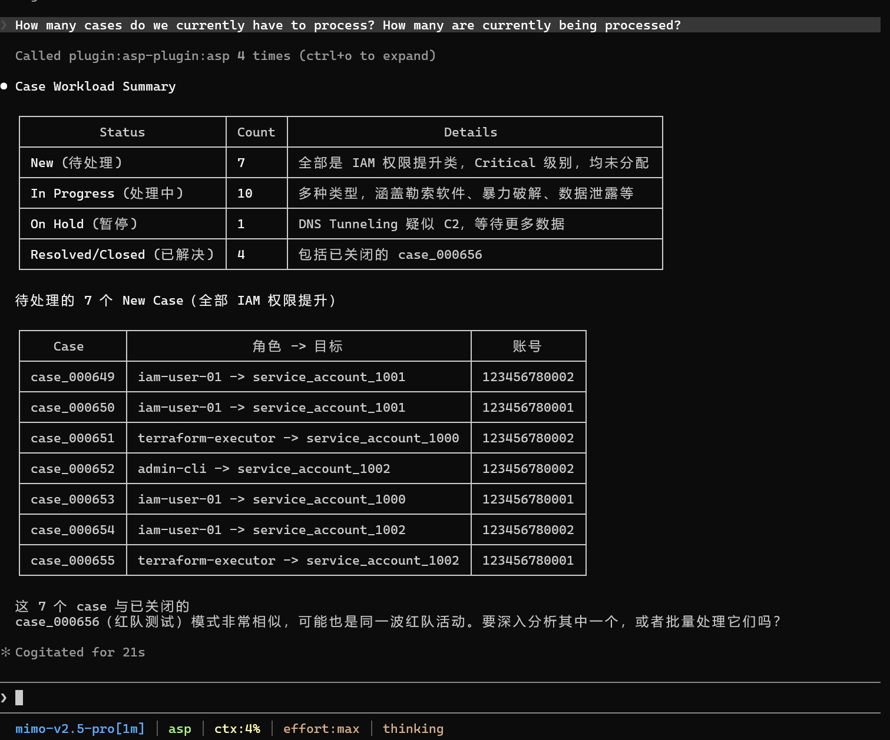

# Case

Case 管理：查看、筛选、更新工作流/AI 分析字段，查看讨论记录。

## 触发场景

- 查看/理解某个 Case
- 按状态/严重程度/判定结果筛选 Case
- 更新 Case 的状态、判定、严重程度、分析师注释
- 查看 Case 的讨论记录

## 使用样例

## 输入

| 参数      | 说明                                                                                  |
|---------|-------------------------------------------------------------------------------------|
| case_id | Case ID，如 `case_000001`                                                             |
| 过滤条件    | status, severity, confidence, verdict, correlation_uid, title, tags                 |
| 更新字段    | severity, status, verdict, severity_ai, confidence_ai, verdict_ai, comment, summary |

## 输出

Case 详情：ID、标题、严重程度、状态、判定、置信度、时间线、关联告警、讨论记录、AI 分析字段。

## 依赖

调用 MCP 工具：`list_cases`、`update_case`。保存分析需配合 `asp-enrichment-en/zh`。
