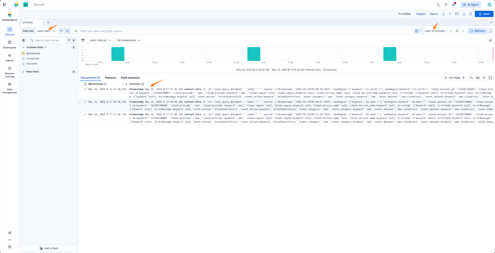

# ELK 插件

## 功能介绍

- Elasticsearch (ELK/Kibana) SIEM 客户端插件,基于 `elasticsearch-py` 实现.
- 提供结构化查询、关键词搜索、字段发现、聚合分析等功能.
- 使用 index_action.py 脚本可将 index 中的告警转发到 Redis Stream 消息队列,供模块消费.

> 此功能可替代 Forwarder 插件接收 Webhook 的功能,适用于 ELK 社区版

- 配合 SIEM 插件的 YAML 索引配置使用.

## 配置方法

- 将 `PLUGINS/ELK/CONFIG.example.py` 重命名为 `CONFIG.py`
- 根据代码注释填写配置项

```python
ELK_HOST = "https://10.10.10.10:9200"
ELK_KEY = "X0XXXXXX=="

ACTION_INDEX_NAME = "siem-alert"
POLL_INTERVAL_MINUTES = 1
```

| 配置项                   | 说明                   |
|-----------------------|----------------------|
| ELK_HOST              | Elasticsearch 服务地址   |
| ELK_KEY               | ELK Personal API key |
| ACTION_INDEX_NAME     | 告警索引名称               |
| POLL_INTERVAL_MINUTES | 轮询间隔(分钟)             |

## 发送告警到 Redis Stream (index action)

- 创建 connector


index 可自定义,但需要和 CONFIG.py 中的 ACTION_INDEX_NAME 保持一致


- Kibana 中创建 Alert Rule


- 设置 Action


message 代码

```json
{
  "@timestamp": "{{context.date}}",
  "rule": {
    "name": "{{rule.name}}"
  },
  "context": {
    "hits": "[{{context.hits}}]"
  }
}
```

- 等待 Rule 触发后,在 siem_alert 索引中会出现新的告警文档.



- 安装依赖并运行 index_action.py 脚本,即可将告警转发到 Redis Stream 消息队列

```bash
cd ~/agentic-soc-platform
uv sync
python -m PLUGINS.ELK.index_action
```


## 配合使用

- [SIEM 插件](../SIEM/) — 使用 YAML 索引配置定义 ELK 索引的字段映射
- [Forwarder 插件](../Forwarder/) — 接收 Kibana 告警 Webhook 并转发到 Redis Stream
