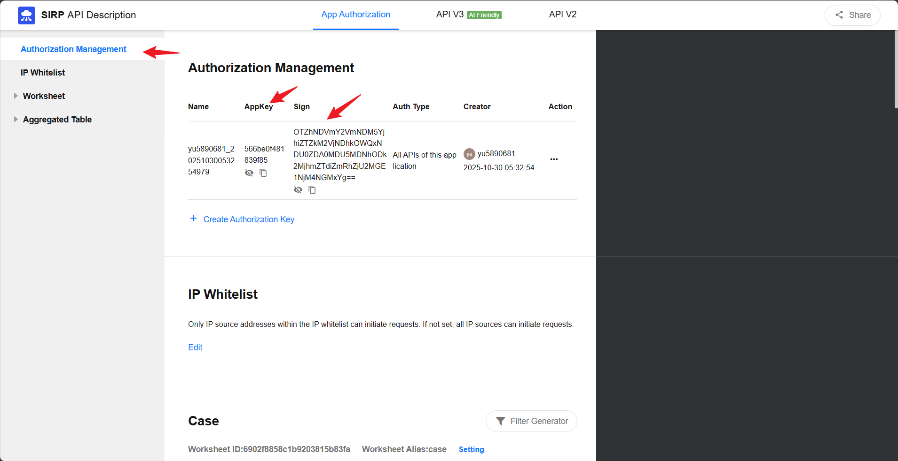

# SIRP 插件

SIRP(Security Incident Response Platform) 是平台的事件响应中枢,基于 Nocoly HAP 实现,提供 Case、Alert、Artifact、Enrichment、Playbook、Knowledge 六类实体的统一管理.

## 部署

[SIRP 安装指南](../../../sirp/Deploy/sirp_install/)

## 配置方法

1. 将 `PLUGINS/SIRP/CONFIG.example.py` 重命名为 `CONFIG.py`
2. 填写配置项:

| 配置项 | 说明 |
|--------|------|
| `SIRP_URL` | SIRP 平台地址,如 `http://192.168.241.128:8880`(私有部署) 或 `https://www.nocoly.com`(云服务) |
| `SIRP_APPKEY` | 应用密钥,从 SIRP 应用管理页面获取 |
| `SIRP_SIGN` | 应用签名,从 SIRP 应用管理页面获取 |
| `SIRP_NOTICE_WEBHOOK` | 通知 Webhook 地址,用于向用户推送消息 |

 

  

## 核心实体

### 实体关系

```
Case ──┬── Alert ──┬── Artifact ── Enrichment
       │           └── Enrichment
       └── Enrichment
```

- **Case**: 安全案件,聚合多个 Alert,是分析师和 AI 分析处理的核心对象
- **Alert**: 告警,通常映射 SIEM Rule 产生的告警,包含 MITRE ATT&CK 映射、风险等级、修复建议等
- **Artifact**: 从告警中提取的实体(IOC),如 IP、域名、哈希、用户等,类型遵循 OCSF/ECS 标准
- **Enrichment**: 富化数据,为 Artifact/Alert/Case 补充威胁情报、CMDB、地理信息等上下文
- **Playbook**: 响应剧本,支持定义和执行自动化响应流程
- **Knowledge**: 知识库,供 AI 和分析师查询的内部安全知识记录

### 关键能力

- 实体创建时自动去重(Artifact 按 name+type+role+value,Enrichment 按 uid 或 type+provider+value)
- 关联数据自动级联加载和保存
- Case 支持 AI 分析调度,通过 Redis Stream 实现冷却期控制(默认 10 分钟)
- Case 支持 AI 评估字段(`severity_ai`、`confidence_ai`、`verdict_ai`)与人工评估字段分离
- Playbook 支持通过 Case ID 发起执行,并跟踪执行状态


