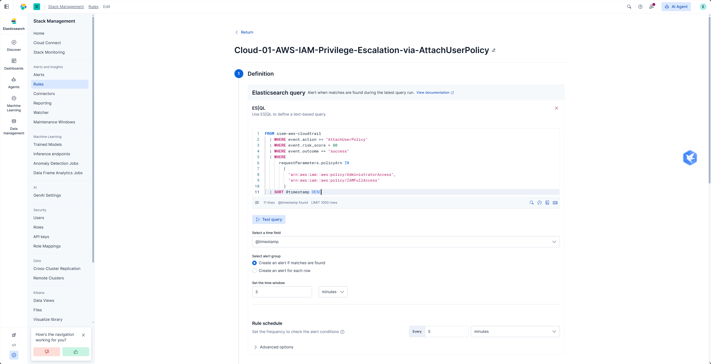
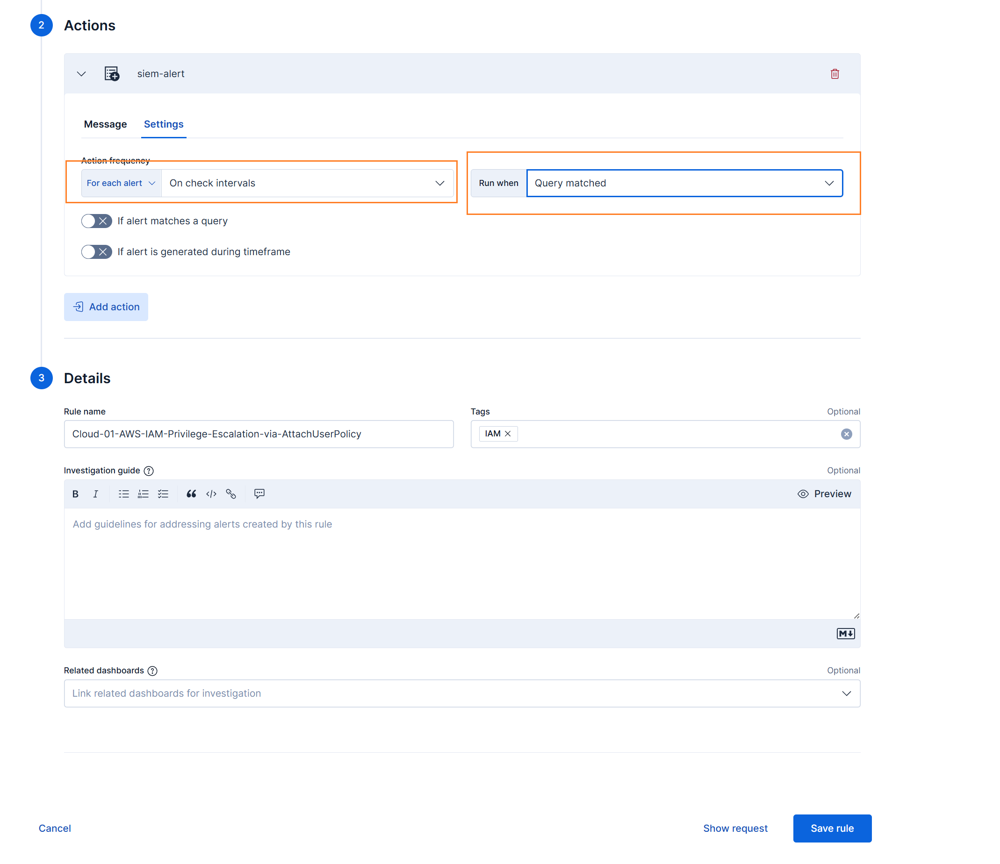

# ELK Index Action

ELK Index Action 用于从 Kibana action 写入的 Elasticsearch 索引中轮询告警。它适合无法让 Kibana 直接 POST 到 ASP Webhook，或希望先把告警 action 落到 Elasticsearch 再由 ASP 拉取的场景。

## 工作方式

```text
Kibana Rule
  -> Index Action 写入 Elasticsearch 索引
  -> ASP ELK action worker 轮询 Action Index
  -> 转换为 Kibana webhook payload
  -> 写入 Redis Stream
  -> Module 处理告警并生成 Case / Alert / Artifact
```

## 配置位置

ELK 连接、Action Index、轮询间隔和读取数量在 [SIEM 设置](../../../settings/siem/#elk-index-action) 中配置。

本页只说明接入流程、Kibana action 内容和 worker 运行方式。

## 创建 Index Connector

在 Kibana 中创建 Index Connector，将 action 写入指定 Elasticsearch 索引。


索引名可以自定义，但需要与 SIEM 设置中的 Action Index 保持一致。


## Kibana Action 内容

创建 Kibana Alert Rule，配置查询条件、执行周期和触发条件。




为 Rule 添加 Index Action，并使用前面创建的 connector。




Action 写入的文档需要包含规则名和命中的原始事件。ASP 会读取：

| 字段 | 说明 |
| --- | --- |
| `rule.name` | 作为 Stream 名称和告警规则名。 |
| `context.hits` | 告警命中的事件列表，可以是数组，也可以是 JSON 字符串。 |

示例结构：

```json
{
  "@timestamp": "{{context.date}}",
  "rule": {
    "name": "{{rule.name}}"
  },
  "context": {
    "hits": "[{{context.hits}}]"
  }
}
```

等待 Rule 触发后，Action Index 中会出现新的告警文档。


## 启动 Worker

ELK Index Action 需要后台 worker 持续运行：

```bash
python manage.py run_elk_action_worker
```

常用参数：

| 参数 | 说明 |
| --- | --- |
| `--index` | 覆盖系统设置中的 Action Index。 |
| `--interval` | 覆盖系统设置中的轮询间隔。 |
| `--size` | 覆盖系统设置中的每次读取数量。 |
| `--start-time` | 第一次轮询的起始时间，例如 `2026-06-23T00:00:00Z`。 |


可以在 Redis 或 [Custom Console](../../custom-console/) 中查看 worker 写入的消息，确认后续 Module 能够消费。


## 与 Webhook 的区别

| 方式 | 说明 |
| --- | --- |
| Webhook | SIEM 直接 POST 到 ASP 的 `/api/webhook/kibana/` 或 `/api/webhook/splunk/`。 |
| ELK Index Action | Kibana 先把 action 写入 Elasticsearch 索引，ASP 再由 worker 轮询读取。 |

两种方式进入 ASP 后都会写入 Redis Stream，并交给 Module 继续处理。

## 使用建议

- 如果网络允许 SIEM 直接访问 ASP，优先使用 Webhook。
- 如果只方便让 Kibana 写入 Elasticsearch 索引，可以使用 ELK Index Action。
- 保证 action 文档中的 `rule.name` 和 `context.hits` 字段完整。
- 保持 worker 持续运行，否则索引中的 action 不会被拉取处理。
- 需要完整示例时，参考 [Custom Module 示例](../../custom-examples/modules/)。
