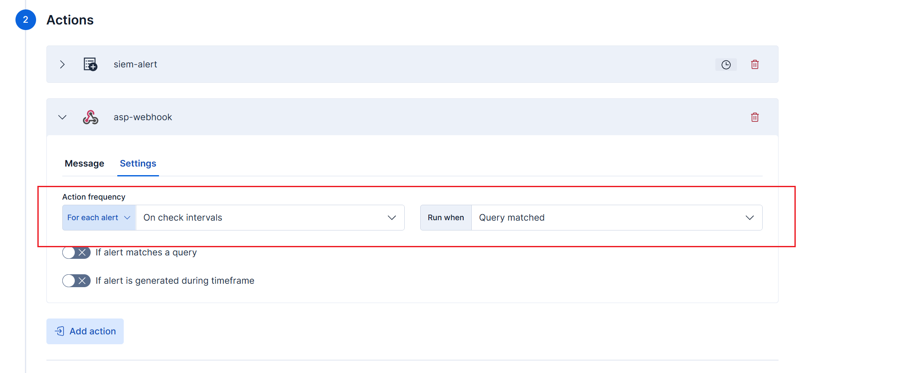
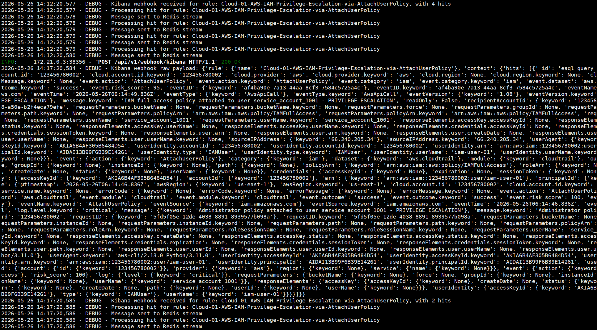

# Kibana Webhook

Kibana Webhook 用于把 Kibana Rule 的命中结果直接发送到 ASP，并写入 Redis Stream 供 Module 消费。

## 端点

```text
POST /api/webhook/kibana/
```

将地址中的域名替换为你的 ASP 后端地址，例如：

```text
https://asp.example.com/api/webhook/kibana/
```

## 创建 Webhook Connector

在 Kibana 中创建 Webhook connector，URL 填写 ASP 当前端点：

```text
https://<asp-host>/api/webhook/kibana/
```


## 创建 Rule

创建 Kibana Alert Rule，配置查询条件、执行周期和触发条件。


## 配置 Action

为 Rule 添加 Webhook Action，并使用前面创建的 connector。




ASP 当前 Kibana Webhook 需要以下 JSON 结构：

```json
{
  "rule": {
    "name": "{{rule.name}}"
  },
  "context": {
    "hits": [{{{context.hits}}}]
  }
}
```

字段说明：

| 字段 | 说明 |
| --- | --- |
| `rule.name` | Kibana Rule 名称，会作为 Redis Stream 名称。 |
| `context.hits` | 命中的事件列表，ASP 会逐条写入 Stream。 |

## 验证

Rule 触发后，Kibana 会向 ASP Webhook 发送请求。ASP 会提取每个 hit 的 `_source`，写入以 `rule.name` 命名的 Redis Stream。



可以在 Redis 或 [Custom Console](../../custom-console/) 中查看写入的消息，确认后续 Module 能够消费。


## 使用建议

- Webhook 方式要求 Kibana 能直接访问 ASP 后端。
- 如果网络不允许直接 POST 到 ASP，或 ELK 使用的是社区版，可以改用 [ELK Index Action](../elk-index-action/)。
- 保持 Rule 名称与后端 Module 期望消费的 Stream 名称一致。
- 保留 `_source` 中用于 Case、Alert、Artifact 映射的关键字段。
- 需要完整示例时，参考 [Custom Module 示例](../../custom-examples/modules/)。
