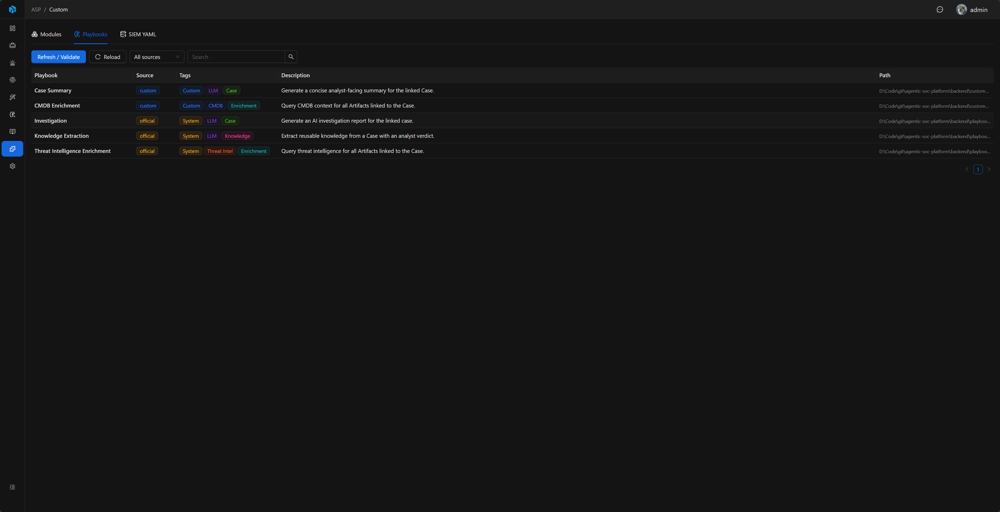
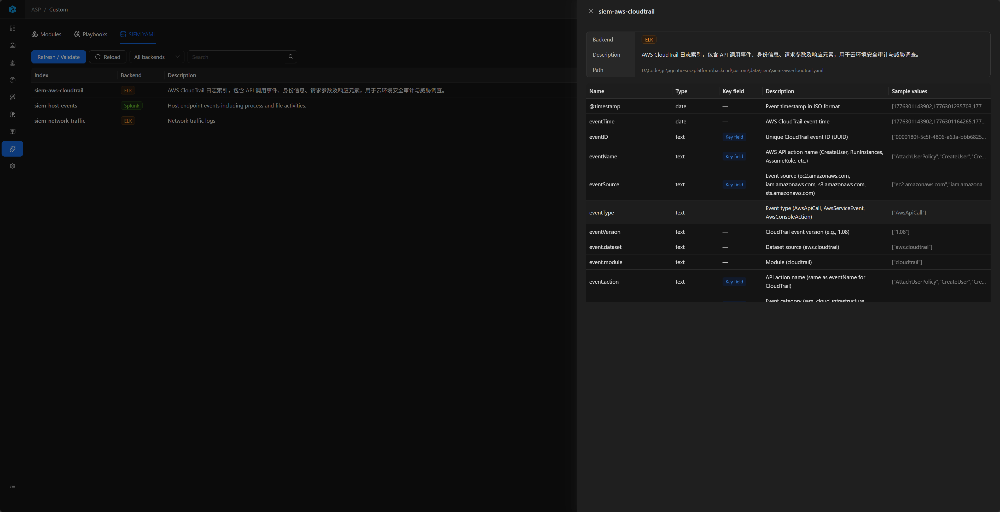

# Custom Console

Custom Console 是 ASP 定制开发的运行时观察和校验页面，用于确认当前环境中 Module、Playbook 和 SIEM YAML 是否被正确加载。它不替代代码编辑器，也不负责在线创建复杂定义；创建和修改仍建议通过代码仓库、Claude
Code 或对应 Skill 完成。

## 入口

Custom Console 位于左侧导航栏的 `Custom`，只有管理员可以访问。

## 它解决什么问题

定制开发通常横跨文件、依赖、Redis Stream、后端 registry 和前端运行入口。Custom Console 的作用是把这些运行时状态集中展示出来，帮助开发者回答：

- 新增或修改的 Module 是否被扫描到。
- Module 监听的 Redis Stream 是否存在、是否有消息、consumer group 是否正常。
- 新增或修改的 Playbook Definition 是否被扫描到，以及它的来源、标签和描述是否正确。
- SIEM YAML 是否可以解析，字段、关键字段和后端类型是否符合预期。
- 手动刷新/校验时是否有异常，异常对应到哪个文件。

## 页面结构

| Tab       | 用途                                             | 推荐配合阅读                           |
|-----------|------------------------------------------------|----------------------------------|
| Modules   | 查看 Module 名称、描述、脚本路径、Stream 名称、线程数和 Stream 状态。 | [Module 开发](../module-examples/) |
| Playbooks | 查看可运行 Playbook Definition、来源、标签、描述和脚本路径。       | [Playbook 开发](../playbook/)      |
| SIEM YAML | 查看 SIEM 索引 YAML、后端类型、字段数量、关键字段数量和字段明细。         | [SIEM YAML](../siem-yaml/)       |

Playbooks 会区分 `official` 和 `custom` 来源。Modules 和 SIEM YAML 没有 official/custom 概念，因此不显示来源字段。

## Refresh / Validate

每个 Tab 都提供独立的 `Refresh / Validate`：

- Modules：重新扫描 Module 脚本，刷新 Module 列表和加载错误。
- Playbooks：重新扫描内置和自定义 Playbook 脚本，刷新 Definition 列表和加载错误。
- SIEM YAML：重新扫描 YAML，并刷新 SIEM registry cache。

打开页面时会自动读取当前加载状态，不写入 Audit Log。手动执行 `Refresh / Validate` 会写入 Audit Log，便于追踪谁在什么时候触发过重新扫描。

如果只修改了脚本定义或 YAML 内容，通常可以直接使用 `Refresh / Validate`。如果修改了 `custom\requirements.txt`、安装了新的第三方 Python 包，或调整了公共 helper
module，需要先重新安装依赖并重启相关容器，再回到 Custom Console 校验。

## Modules

Modules Tab 用于观察 Module 是否已经被运行时识别，以及它和 Redis Stream 的关系。

列表主要字段：

| 字段            | 说明                                                                     |
|---------------|------------------------------------------------------------------------|
| Module        | Module 的 `NAME`。                                                       |
| Description   | Module 的 `DESC`。                                                       |
| Stream        | Module 的 `STREAM_NAME`，需要和 Webhook / ELK Index Action 写入的 Stream 名称一致。 |
| Threads       | Module 的 `THREAD_NUM`。                                                 |
| Stream Health | Redis Stream 是否存在、长度、首尾消息 ID、consumer group 摘要。                        |
| Path          | Module 脚本路径。                                                           |

### Stream Inspection

Modules 详情中可以只读查看 Redis Stream：

- Stream 基础信息。
- Consumer group 摘要。
- 最近消息 JSON。
- 按 message ID 读取指定消息。

该功能只读，不会写入 Stream、消费消息、删除 Stream，也不会触发 Module 运行。它适合用于确认 SIEM 告警是否已经进入 Stream，以及 Module 消费前后 Stream 状态是否合理。

## Playbooks

Playbooks Tab 展示当前可由 Case 页面运行的 Playbook Definition。它只负责展示和校验，不在 Custom Console 里直接运行 Playbook。要测试 Playbook，请在 Case 详情页使用 `Run Playbook`。

列表主要字段：

| 字段          | 说明                           |
|-------------|------------------------------|
| Playbook    | Playbook 的 `NAME`。           |
| Source      | `official` 或 `custom`。       |
| Tags        | Playbook 的 `TAGS`，用于筛选和识别用途。 |
| Description | Playbook 的 `DESC`。           |
| Path        | Playbook 脚本路径。               |

Prompt 文件不是 Custom Console 的管理对象。Playbook 可以把 prompt 写在代码中，也可以自行调用 `self.read_prompt("System")` 读取文件；Custom Console 不会校验 prompt 文件是否存在。

## SIEM YAML

SIEM YAML Tab 展示每个 YAML 定义的 index、后端、字段数量、关键字段数量和字段表。它适合用于确认 Agent / MCP 查询可见的 SIEM schema 是否符合预期。

字段表包含：

| 字段            | 说明         |
|---------------|------------|
| Name          | 字段名。       |
| Type          | 字段类型。      |
| Key field     | 是否标记为关键字段。 |
| Description   | 字段含义。      |
| Sample values | 示例值。       |

新建或大幅修改 YAML 通常需要理解日志结构和查询场景，建议使用 [SIEM YAML](../siem-yaml/) 文档或 [SIEM Index YAML Skill](../../integrations/claude-code/skills/siem-index-yaml/)
辅助完成。Custom Console 只负责展示和校验最终加载结果。

## 相关文档

- [定制开发总览](../)：了解 Module、Playbook、SIEM YAML 在 ASP 中的关系。
- [Module 开发](../module-examples/)：编写 Redis Stream 消费逻辑。
- [Playbook 开发](../playbook/)：编写 Case 触发的自动化任务。
- [SIEM YAML](../siem-yaml/)：维护 Agent / MCP 可查询的索引字段定义。
- [部署：定制目录](../../quick-start/deployment/#定制目录)：了解部署包中 `custom/` 的目录结构和依赖安装方式。
