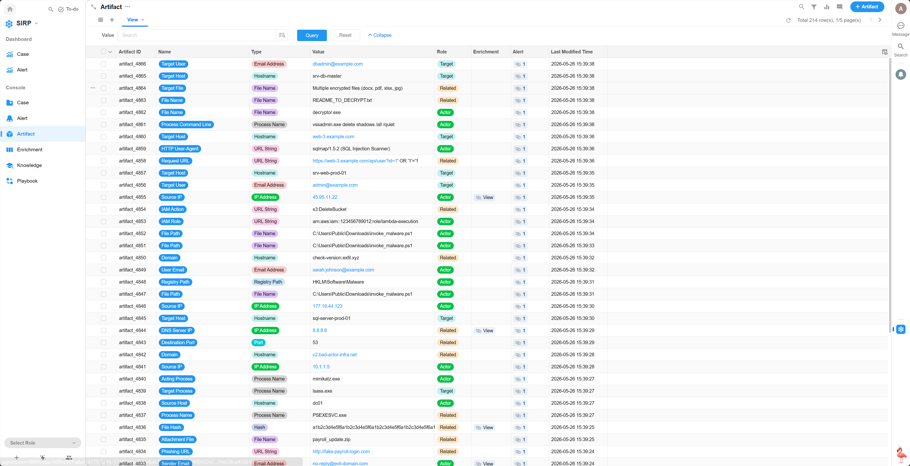

# Artifact

- Artifact 是指与安全事件相关的具体数据项或证据，用于支持调查和响应工作。
- Artifact 可以包括各种类型的数据，如 IP 地址、域名、文件哈希值、URL、电子邮件地址等。
- Artifact 挂载到 Alert 上，用于帮助分析和调查安全事件。
- 查询/响应/富化等操作通常会基于 Artifact 进行，例如查询某个主机名的 Owner 信息、查询某个文件哈希值的威胁情报、封禁某个 IP 地址等。

## View

> 支持多种筛选和排序功能。

## Detail

> 操作面板

## Enrichments

> 关联的 Enrichment 记录

## Alerts

> 关联的 Alert 记录