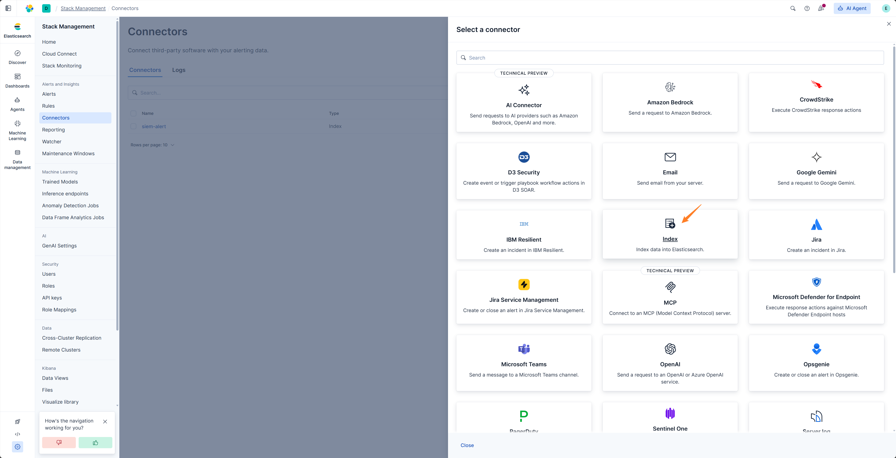

# ELK 插件

## 功能介绍

- Elasticsearch（ELK/Kibana）SIEM 客户端插件，基于 `elasticsearch-py` 实现。
- 提供结构化查询、关键词搜索、字段发现、聚合分析等功能（配合 [SIEM 插件](../SIEM/index.md) YAML 索引配置）。
- 使用 Kibana 的 index action 可将 rule 产生的告警发送到指定的 index，index_action.py 脚本可将 index 中的告警转发到 Redis Stream 消息队列，供模块消费。

> 此功能可替代 Forwarder 插件接收 Webhook 的功能，适用于 ELK 社区版。

- 使用 Kibana 的 webhook action 可将 rule 产生的告警发送到 Forwarder，Forwarder 将接收的告警转发到 Redis Stream 消息队列，供模块消费。

## 配置方法

- 将 `PLUGINS/ELK/CONFIG.example.py` 重命名为 `CONFIG.py`
- 根据代码注释填写配置项。

```python
ELK_HOST = "https://10.10.10.10:9200"
ELK_KEY = "X0XXXXXX=="

ACTION_INDEX_NAME = "siem-alert"
POLL_INTERVAL_MINUTES = 1
```

| 配置项                   | 说明                    |
|-----------------------|-----------------------|
| ELK_HOST              | Elasticsearch 服务地址    |
| ELK_KEY               | ELK Personal API key  |
| ACTION_INDEX_NAME     | 告警索引名称                |
| POLL_INTERVAL_MINUTES | index_action 轮询间隔(分钟) |

## 发送告警到 Redis Stream (index action)

- 配置 [Redis 插件](../RedisStack/index.md)

> index_action.py 需要读取 Redis 插件的 CONFIG.py 中的配置项，且确保正确配置。

- 创建 connector




index 可自定义，但需要和 CONFIG.py 中的 ACTION_INDEX_NAME 保持一致。


- Kibana 中创建 Alert Rule


- 设置 Action


message 代码

```json
{
  "@timestamp": "{{context.date}}",
  "rule": {
    "name": "{{rule.name}}"
  },
  "context": {
    "hits": "[{{context.hits}}]"
  }
}
```

- 等待 Rule 触发后，在 siem_alert 索引中会出现新的告警文档。


- 安装依赖并运行 index_action.py 脚本，即可将告警转发到 Redis Stream 消息队列。

```bash
cd ~/agentic-soc-platform
uv sync
python -m integrations.ELK.index_action
```


- 登录 Redis Insight 可查看 Stream 中的告警


## 发送告警到 Redis Stream (webhook action)

- 配置 [Forwarder 插件](../Webhook/index.md)

- 创建 connector


url 为 http://192.168.163.128:7000/api/v1/webhook/kibana，根据实际情况替换 ip 和端口。

- Kibana 中创建 Alert Rule


- 设置 Action


message 代码

```
{
  "rule":{
    "name":"{{rule.name}}"
  },
  "context":{
    "hits":[{{{context.hits}}}]
  }
}
```

- 等待 Rule 触发后，Forwarder 中会产生对应日志。


- 登录 Redis Insight 可查看 Stream 中的告警

