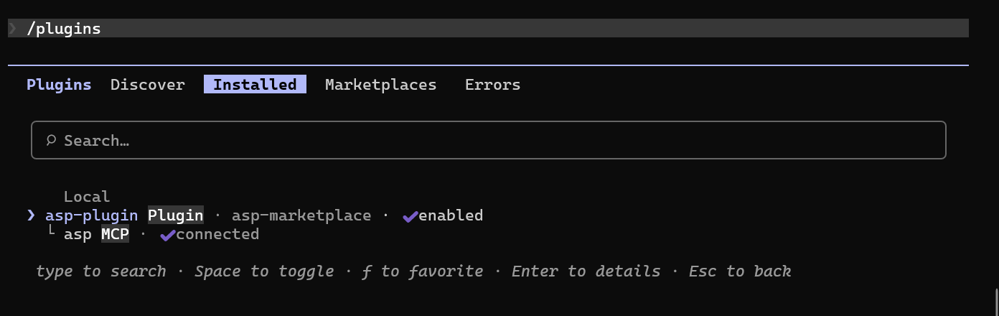

# ClaudeCode 插件

ClaudeCode 插件让 Claude Code 中的 Agent 和 Skill 使用 ASP 能力。当前插件代码位于 `asp-marketplace`，通过 ASP MCP Server 连接后端。

## 功能列表

- **3 个 Agent**
  - [Case Investigator](agents/case-investigator/)：围绕 Case 做调查、分诊、证据判断和下一步决策。
  - [Artifact Investigator](agents/artifact-investigator/)：围绕 IOC / Artifact 做上下文分析、范围判定和威胁猎杀。
  - [Threat Hunting](agents/threat-hunting/)：面向假设驱动的主动威胁猎杀。

- **15 个 Skill**
  - [Alert](skills/alert/) / [Artifact](skills/artifact/) / [Case](skills/case/) / [Enrichment](skills/enrichment/) / [Knowledge](skills/knowledge/)
  - [Comment](skills/comment/) / [File](skills/file/) / [CMDB](skills/cmdb/)
  - [Module Creator](skills/module-creator/)
  - [Playbook](skills/playbook/) / [Playbook Creator](skills/playbook-creator/)
  - [SIEM Index YAML](skills/siem-index-yaml/) / [SIEM Search](skills/siem-search/) / [SIEM Rule](skills/siem-rule/)
  - [Threat Intelligence](skills/threat-intelligence/)

## MCP 配置

插件使用 Streamable HTTP 连接 ASP MCP Server。

| 项 | 当前值 |
| --- | --- |
| MCP URL | `https://<asp-host>/api/mcp` |
| 认证方式 | `Authorization: Api-Key <key>` |
| 环境变量 | `ASP_MCP_URL`、`ASP_MCP_API_KEY` |

API Key 可在 [个人中心](../../workspace/personal-center/) 创建。

必须在启动 Claude Code 前，在同一个终端中配置以下环境变量；如果 Claude Code 已经启动，修改环境变量后需要重新启动 Claude Code。

PowerShell:

```powershell
$env:ASP_MCP_URL = "https://asp.example.com/api/mcp"
$env:ASP_MCP_API_KEY = "asp_xxx"
```

测试当前终端中的环境变量是否可连接：

```powershell
Invoke-RestMethod $env:ASP_MCP_URL -Method Post -Headers @{Authorization="Api-Key $env:ASP_MCP_API_KEY"; Accept="application/json, text/event-stream"} -ContentType "application/json" -Body '{"jsonrpc":"2.0","id":1,"method":"initialize","params":{"protocolVersion":"2025-06-18","capabilities":{},"clientInfo":{"name":"env-test","version":"1.0"}}}'
```

Bash:

```bash
export ASP_MCP_URL="https://asp.example.com/api/mcp"
export ASP_MCP_API_KEY="asp_xxx"
```

测试当前终端中的环境变量是否可连接：

```bash
curl -sS "$ASP_MCP_URL" \
  -H "Authorization: Api-Key $ASP_MCP_API_KEY" \
  -H "Content-Type: application/json" \
  -H "Accept: application/json, text/event-stream" \
  --data '{"jsonrpc":"2.0","id":1,"method":"initialize","params":{"protocolVersion":"2025-06-18","capabilities":{},"clientInfo":{"name":"env-test","version":"1.0"}}}'
```

如果返回 MCP initialize 结果，说明 URL 和 API Key 可用；如果返回 401 或 Invalid API key，请检查 API Key 是否过期、用户是否被禁用，以及 `/api/mcp` 是否路由到 ASGI 服务。

## 安装插件

启动 Claude Code 后，注册 marketplace：

```text
/plugin marketplace add FunnyWolf/asp-marketplace
```

从 marketplace 安装插件：

```text
/plugin install asp-plugin@asp-marketplace
```




## 调用 Skill / Agent

插件安装并连接 MCP 后，可以在 Claude Code 中直接调用 ASP 相关 Skill / Agent。


## 补充说明

- 插件包含 MCP 配置、Agents 和 Skills，会占用一定上下文。


- 如果只在特定仓库中使用 ASP 插件，建议安装到 repo local，减少其他项目中的上下文占用。


