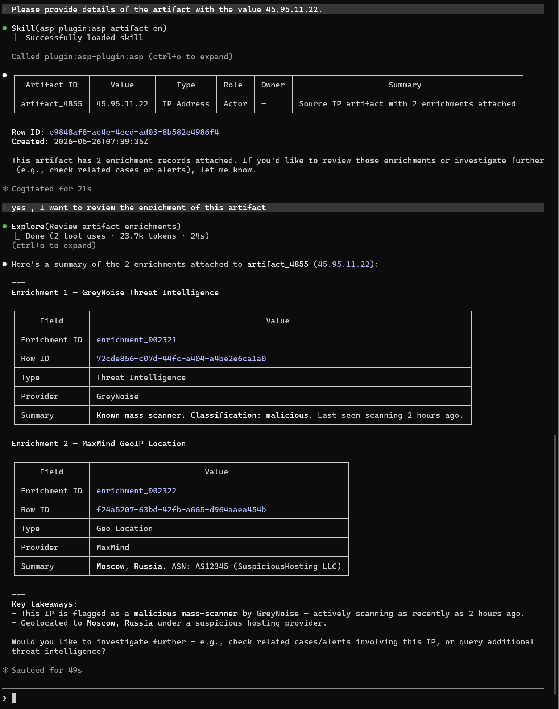

# Artifact

Artifact Skill 用于按 IOC 值、类型或角色查找平台中的实体记录。

## 触发场景

- 查找某个 IP、域名、URL、文件哈希、账号或主机是否在 ASP 中出现。
- 查看实体的 Type、Role、Value 和关联告警。
- 为实体后续添加 Enrichment 或继续做威胁情报查询。

## 使用样例

## 输入

| 输入 | 说明 |
| --- | --- |
| `artifact_id` | 可读实体 ID，例如 `artifact_000001`。 |
| `value` | 实体值。 |
| `type` | 实体类型。 |
| `role` | 实体在事件中的角色。 |

## 输出

Artifact 列表或单条实体详情，包括关联告警和富化数量。

## 依赖

MCP 工具：`list_artifacts`。
