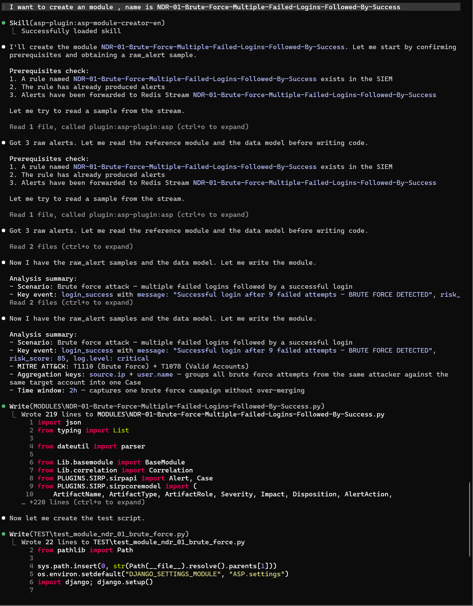

# Module Creator

Module Creator Skill 用于为 SIEM Rule 创建 ASP 告警处理模块。

## 触发场景

- 为新的 SIEM Rule 编写 `backend/modules/` 下的 Python Module。
- 把 Webhook 或 ELK Index Action 写入的 raw alert 转换为 Case / Alert / Artifact。
- 设计 Correlation UID 和 Artifact 提取逻辑。

## 使用样例

## 输入

| 输入 | 说明 |
| --- | --- |
| Rule 名称 | 通常也作为 Redis Stream 名称。 |
| raw alert 样本 | 从 Stream、样本文件或用户粘贴获取。 |
| 聚合策略 | Correlation UID 的字段和时间窗口。 |

## 输出

建议的 Module 文件、字段映射、Artifact 提取逻辑、Correlation UID 设计和验证方式。

## 依赖

- `backend/modules/`
- 当前 backend 的 Case / Alert / Artifact 枚举模型
- MCP 工具：Stream 读取相关工具
