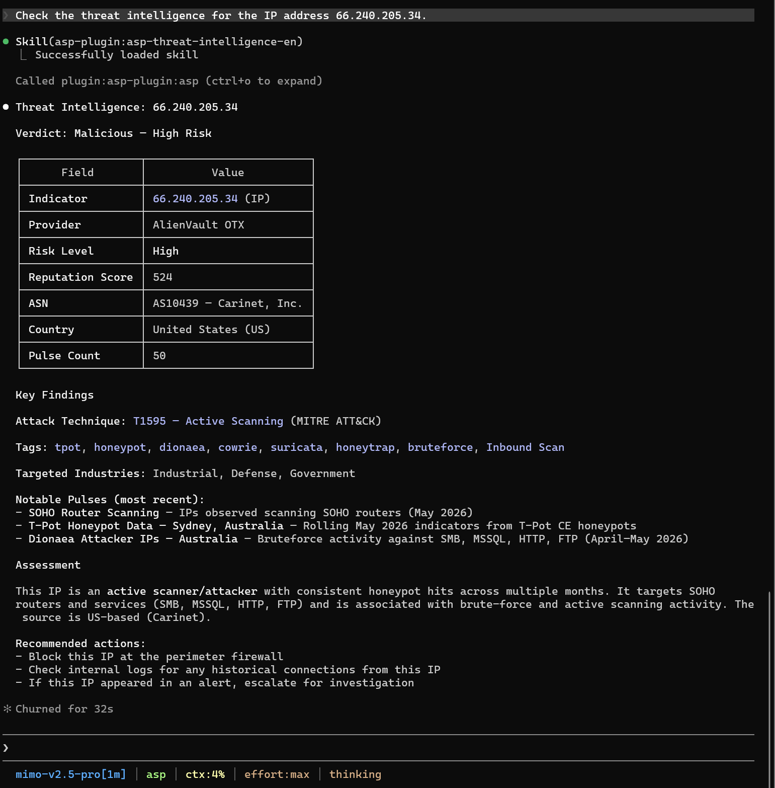

# Threat Intelligence

Threat Intelligence Skill 用于查询 IOC 的威胁情报并评估风险等级。

## 触发场景

- 查询 IP、URL、文件哈希等 IOC 的威胁情报。
- 判断 Artifact 是否恶意。
- 将查询结果作为 Enrichment 保存到 Artifact 或 Case。

## 使用样例

## 输入

| 输入 | 说明 |
| --- | --- |
| `indicator` | IOC 值。 |
| `artifact_type` | Artifact 类型。 |
| `provider` | 可选情报源。 |

## 输出

Provider 结果、风险等级、声誉、恶意判断、标签和错误信息。

## 依赖

MCP 工具：`ti_query`。保存结果时配合 `asp-enrichment`。
