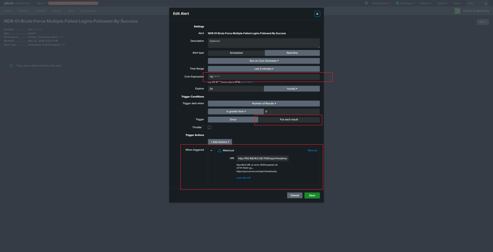

# Splunk Webhook

Splunk Webhook 用于把 Splunk Alert 结果直接发送到 ASP。

## 端点

```text
POST /api/webhook/splunk/
```

将地址中的域名替换为你的 ASP 后端地址，例如：

```text
https://asp.example.com/api/webhook/splunk/
```

## 在 Splunk 中创建 Alert

编写 SPL 后保存为 Alert。



建议配置：

- Cron Expression / Time Range 根据检测频率设置，例如每 5 分钟执行一次，搜索前 5 分钟数据。
- Trigger 选择 `For each result`，确保每个结果独立发送一次 Webhook。
- Webhook URL 填写 ASP 当前端点：`https://<asp-host>/api/webhook/splunk/`。

## Payload 要求

ASP 当前 Splunk Webhook 读取以下字段：

| 字段 | 说明 |
| --- | --- |
| `search_name` | Splunk Alert 名称，会作为 Redis Stream 名称。 |
| `result` | 单条告警结果，会写入 Stream 供 Module 处理。 |
| `sid` | 可选，Splunk search job id。 |
| `app` | 可选，Splunk app。 |
| `owner` | 可选，Splunk owner。 |
| `results_link` | 可选，回到 Splunk 查看结果的链接。 |

## 验证

Alert 触发后，Splunk 会向 ASP Webhook 发送请求。ASP 返回成功后，结果会写入以 `search_name` 命名的 Redis Stream。


可以在 Redis 中查看写入的消息，确认后续 Module 能够消费。


## 使用建议

- 保持 SPL 输出字段稳定，避免 Module 字段映射频繁变化。
- Alert 名称应与后端 Module 期望消费的 Stream 名称一致。
- 对同一类事件输出稳定的关联字段，便于后续生成 Correlation UID。
