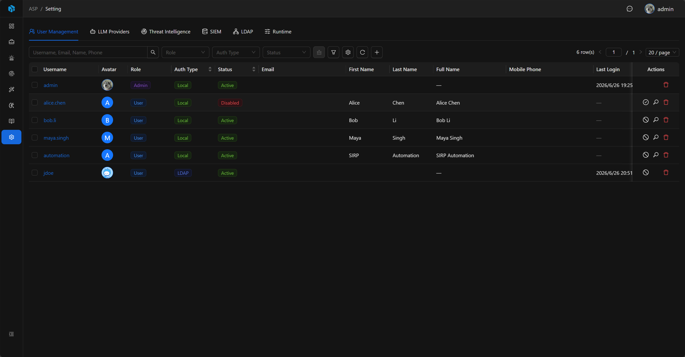

# 系统设置

系统设置用于管理 ASP 的用户、认证、LLM、SIEM、威胁情报和 Runtime 等运行配置。

## 入口与权限

系统设置入口位于前端 `/system`。只有管理员可以进入该页面并调用相关设置接口。

## 设置项

| 设置                  | 说明                                         |
|---------------------|--------------------------------------------|
| User Management | 管理用户、角色、认证类型和账号状态。 |
| LLM Providers       | 配置可供 AI 调查、知识提取和 Runtime 使用的模型提供商。 |
| Threat Intelligence | 配置 AlienVault OTX 威胁情报。                    |
| SIEM                | 配置 Splunk 和 ELK 连接。                        |
| LDAP                | 配置 LDAP 登录。                                |
| Runtime             | 配置 Agentic 运行参数。                           |

## 接口与审计

运行配置接口主要位于 `/api/settings/` 下；用户管理位于 `/api/auth/users/`。

LLM、威胁情报、SIEM 和 LDAP 配置都支持测试连接。设置更新、测试连接和密钥 reveal 会写入 Audit Log；密钥字段在审计记录中只记录是否发生变化或 reveal，不直接写入明文。
