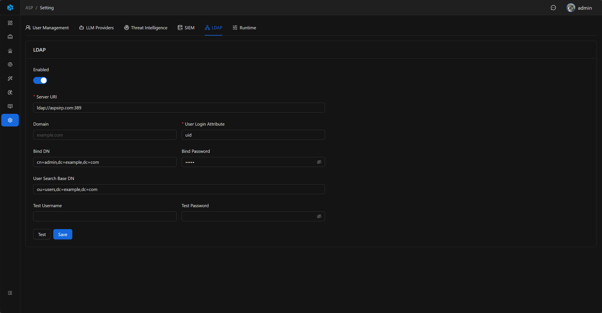
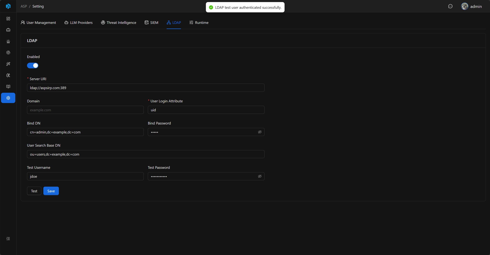

# LDAP

LDAP 用于接入企业身份源。

## 入口

LDAP 设置位于 System Settings 的 `LDAP` Tab。

## 配置项

| 字段                  | 说明                                       |
|---------------------|------------------------------------------|
| Enabled             | 是否启用 LDAP 登录。                            |
| Server URI          | LDAP 服务地址，必须以 `ldap://` 或 `ldaps://` 开头。 |
| Domain              | 直连绑定模式下拼接 `username@domain` 使用。          |
| Bind DN             | 可选的服务账号 DN，用于先搜索用户。                      |
| Bind Password       | Bind DN 对应密码。                            |
| User Search Base DN | 用户搜索起点 DN。                               |
| User Login Attr     | 登录名匹配字段，默认 `uid`。                        |

## Windows AD 常见配置

Windows Active Directory 通常使用搜索绑定模式：

| 字段                  | 示例                                                                         |
|---------------------|----------------------------------------------------------------------------|
| Server URI          | `ldaps://ad.example.com:636` 或 `ldap://ad.example.com:389`                 |
| Domain              | `example.com`                                                              |
| Bind DN             | `svc_asp@example.com` 或 `CN=svc-asp,OU=Service Accounts,DC=example,DC=com` |
| Bind Password       | 服务账号密码                                                                     |
| User Search Base DN | `DC=example,DC=com` 或 `OU=Users,DC=example,DC=com`                         |
| User Login Attr     | `sAMAccountName`                                                           |

如果希望用户用 UPN 登录，也可以把 `User Login Attr` 设置为 `userPrincipalName`，并要求用户在登录页输入完整 UPN，例如 `alice@example.com`。

## 认证模式

配置了 `User Search Base DN` 时，后端会先使用 Bind DN / Bind Password 做 service bind，然后按 `User Login Attr=<username>` 搜索用户 DN，最后使用用户输入的密码绑定该用户 DN。

未配置 `User Search Base DN` 时，后端会直接绑定用户：如果配置了 Domain，则使用 `username@domain`；否则直接使用 `username`。

## 测试连接

不填写 Test Username / Test Password 时，Test 只验证 LDAP bind 是否成功。填写测试账号时，用户名和密码必须同时提供，后端会按当前配置执行一次完整用户认证。

## 登录流程

1. 管理员启用并保存 LDAP 配置。
2. 使用测试功能确认连接和账号查询可用。
3. 管理员在用户管理中创建 Authentication Type 为 LDAP 的 ASP 用户。
4. 用户在登录页切换到 LDAP。
5. 后端确认 ASP 用户存在、账号启用、认证类型为 LDAP。
6. 后端使用 LDAP 验证用户凭据，并以该 ASP 用户登录。

LDAP 登录不会自动创建 ASP 用户，也不会自动分配角色。Local 用户不能使用 LDAP 方式登录，LDAP 用户也不能使用本地密码方式登录。

## 安全与审计

Bind Password 默认隐藏。保存配置、测试连接和 reveal Bind Password 都会写入 Audit Log；密码字段在审计记录中只记录是否 changed 或 reveal，不写入明文。

保存配置后，后端会刷新 LDAP runtime cache，后续登录使用最新配置。

## 使用建议

- 生产环境优先使用 `ldaps://`。
- Windows AD 通常使用 `sAMAccountName` 作为 User Login Attr。
- 将 User Search Base DN 控制在实际用户所在 OU 或域范围内。
- 先用 Test Username / Test Password 验证真实用户登录，再开放给用户使用。
