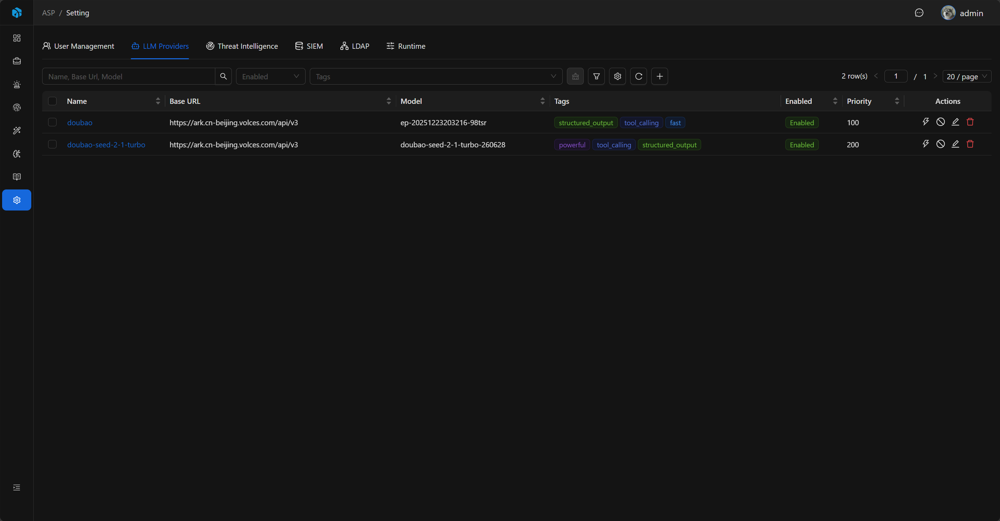
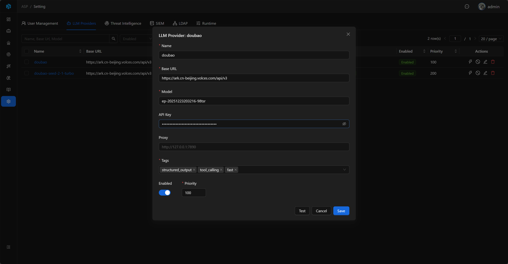

# LLM Provider

LLM Provider 定义 ASP 使用的大模型连接方式。AI 调查、知识提取和 Runtime 会从启用的 Provider 中按标签和优先级选择模型。

## View

LLM Providers 列表展示 Name、Base URL、Model、Tags、Enabled 和 Priority。

列表支持按 Enabled、Tags 快速筛选，也可以通过高级筛选按 Name、Base URL、Model、Enabled、Priority 定位配置。

## 字段

| 字段       | 说明                                 |
|----------|------------------------------------|
| Name     | 配置名称，唯一。                           |
| Base URL | OpenAI Chat Completions 兼容的模型服务地址。 |
| Model    | 模型名称。                              |
| API Key  | 访问密钥，可按模型服务要求填写。                   |
| Proxy    | 可选代理。                              |
| Tags     | 模型能力标签。                            |
| Enabled  | 是否启用。                              |
| Priority | 优先级，数字越小越靠前。                       |

## 新增与编辑

管理员可以新增、编辑、启用、禁用或删除 LLM Provider。编辑时会读取已保存配置；API Key 默认隐藏，只在编辑时通过 reveal 加载。

Proxy 支持 `http://`、`https://`、`socks4://`、`socks5://` 开头的代理地址。

## 标签选择

常用标签：

- `fast`
- `powerful`
- `tool_calling`
- `structured_output`

Tags 至少需要填写一个。前端提供常用标签，但也可以按实际场景添加自定义标签。

不同任务会根据标签选择合适模型。例如结构化输出相关任务会优先选择带有 `structured_output` 的 Provider。

## 测试连接

新增或编辑配置时可以直接 Test；已保存的 Provider 也可以在列表中 Test。

测试会调用 Provider 的 Chat Completions 兼容接口，并发送一个简单请求确认模型服务是否可用。

## 运行时选择

只有 Enabled 的 Provider 会进入运行时配置。运行时按 Priority、Name、Created Time 排序：

- 不指定 tag 时，使用排序后的第一个 Provider。
- 指定一个 tag 时，选择第一个包含该 tag 的 Provider。
- 指定多个 tag 时，选择第一个同时包含所有 tag 的 Provider。

如果没有启用的 Provider，或没有匹配指定 tag 的 Provider，相关 AI 任务会失败。

## 安全与审计

创建、更新、删除、测试和 reveal API Key 都会写入 Audit Log。API Key 字段在审计记录中只记录是否发生变化或 reveal，不写入明文。

## 使用建议

- 至少配置一个启用的 `structured_output` Provider，供调查报告和知识提取使用。
- 用 Priority 控制默认模型选择顺序，数字越小越优先。
- 用 Tags 区分快速模型、强推理模型、工具调用模型和结构化输出模型。
- 保存后先执行 Test，确认 Base URL、Model、API Key 和 Proxy 配置正确。
