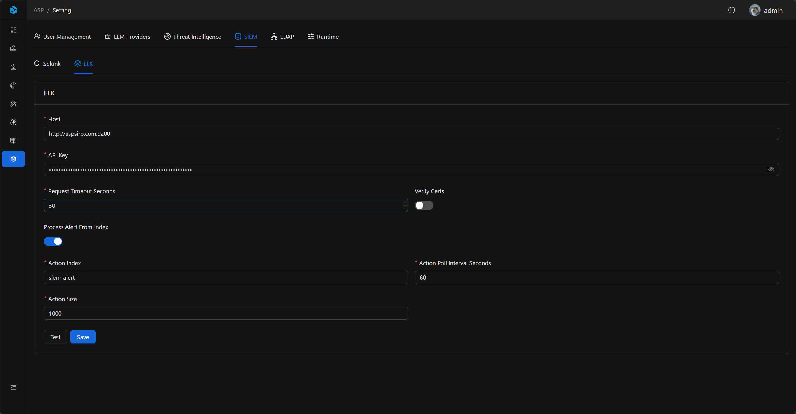

# SIEM

ASP 当前提供 Splunk 和 ELK 连接配置，用于日志查询、Agent 调查和告警接入。

## 入口

SIEM 设置位于 System Settings 的 `SIEM` Tab，包含 Splunk 和 ELK 两个子 Tab。

## Splunk

Splunk 配置用于连接 Splunk 管理接口，供 SIEM 查询能力使用。

| 字段       | 说明                     |
|----------|------------------------|
| Host     | Splunk 服务器地址。          |
| Port     | Splunk 管理端口，默认 `8089`。 |
| Username | 登录用户名。                 |
| Password | 登录密码。                  |
| Scheme   | `http` 或 `https`。      |
| Verify   | 是否校验证书。                |

配置完成后可以使用测试功能验证连接。

## ELK

ELK 配置用于连接 Elasticsearch，供 SIEM 查询能力和 ELK Index Action 使用。

| 字段                               | 说明                     |
|----------------------------------|------------------------|
| Host                             | Elasticsearch 服务地址。    |
| API Key                          | Elasticsearch API Key。 |
| Verify Certs                     | 是否校验证书。                |
| Request Timeout Seconds          | 请求超时时间。                |
| Process Alert From Index Enabled | 是否启用 ELK Index Action 轮询。 |
| Action Index                     | Kibana action 写入的索引名。  |
| Action Poll Interval Seconds     | 轮询间隔。                  |
| Action Size                      | 每次最多读取的 action 数量。     |

## 连接测试与审计

Splunk 和 ELK 都支持 Test。Splunk 测试会连接 Splunk 并读取 service info；ELK 测试会连接 Elasticsearch 并读取 cluster info。

保存配置、测试连接和 reveal 密钥都会写入 Audit Log。Splunk Password 和 ELK API Key 默认隐藏，审计记录中只记录是否 changed 或 reveal，不写入明文。

保存 SIEM 配置后，后端会刷新 SIEM 客户端缓存，后续查询使用最新连接信息。

## SIEM 查询与索引配置

SIEM 连接配置只负责提供 Splunk / ELK 后端凭据。Agent 和 MCP 的 SIEM 查询还依赖 `backend\data\siem\*.yaml` 中的索引配置。

YAML 索引配置用于描述可搜索索引、后端类型、字段含义和默认聚合字段。未配置的索引不会出现在 schema 列表中，也不会参与基于 schema 的查询。

## ELK Index Action

开启 `Process Alert From Index Enabled` 后，后台 worker 会按配置的 Action Index、Poll Interval 和 Action Size 从 Elasticsearch 读取 Kibana action 文档。

读取到的 action 会转换为 Kibana webhook 告警处理流程，继续进入 ASP 的告警接入和 Case / Alert / Artifact 生成流程。

完整接入流程、Kibana action 内容和 worker 运行方式见 [ELK Index Action](../../integrations/elk-index-action/)。

## 使用建议

- 保存后先执行 Test，确认网络、账号、证书和密钥配置正确。
- 只在需要从 Kibana action index 拉取告警时启用 ELK Index Action。
- 为 Agent / MCP 查询维护 `backend\data\siem\*.yaml` 索引配置，避免让 LLM 在未知索引中盲查。
- Webhook 接入请参考集成章节，不在 SIEM 设置页配置。
