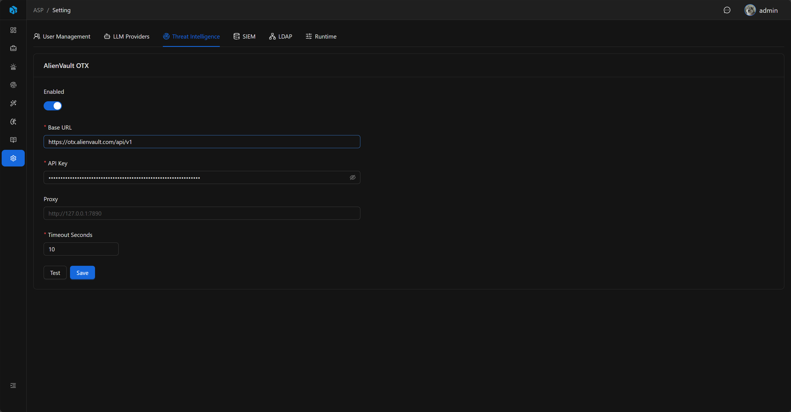
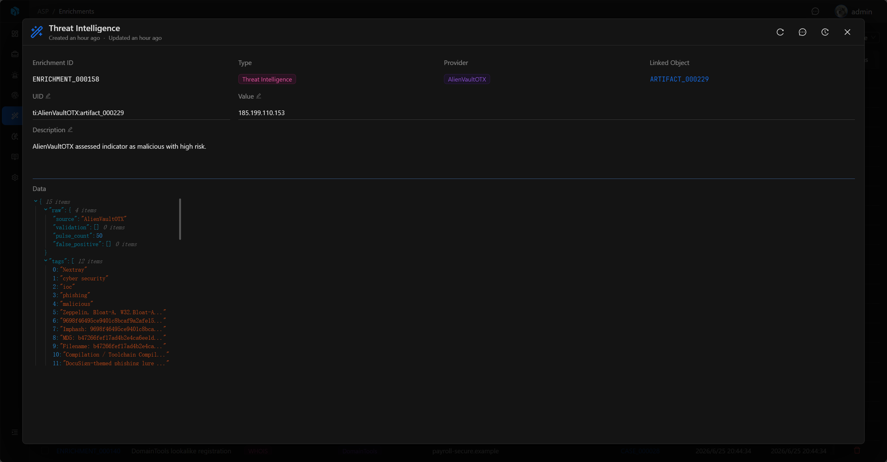

# 威胁情报

威胁情报设置用于配置 ASP 的 IOC 查询能力。当前设置页内置 AlienVault OTX。

## 入口

威胁情报设置位于 System Settings 的 `Threat Intelligence` Tab。

## AlienVault OTX

注册 AlienVault OTX 后，可以在账号设置页获取 API Key。

## 配置项

| 字段              | 说明                                                 |
|-----------------|----------------------------------------------------|
| Enabled         | 是否启用 AlienVault OTX。                               |
| API Key         | AlienVault OTX API Key。                            |
| Base URL        | OTX API 地址，默认 `https://otx.alienvault.com/api/v1`。 |
| Proxy           | 可选代理。                                              |
| Timeout Seconds | 查询超时时间。                                            |

Proxy 支持 `http://`、`https://`、`socks4://`、`socks5://` 开头的代理地址。

## 测试与审计

保存前可以使用 Test 验证配置。测试会使用当前配置访问 OTX 的 IPv4 general 接口，确认 API Key、Base URL、Proxy 和 Timeout 是否可用。

保存配置、测试连接和 reveal API Key 都会写入 Audit Log。API Key 默认隐藏，审计记录中只记录是否 changed 或 reveal，不写入明文。

保存配置后，后端会刷新 OTX runtime cache，后续查询使用最新配置。

## 富化流程

`Threat Intelligence Enrichment` Playbook 会收集 Case 关联 Alert 中的 Artifact，对每个唯一 Artifact 查询威胁情报，并把结果写入 Artifact 的 Enrichment。

写入的 Enrichment 类型为 `Threat Intelligence`，包含 Provider、风险等级、声誉分数、恶意判断、标签、攻击技术、恶意软件家族、脉冲摘要和原始数据摘要等上下文。

## Provider 行为

当前设置页只配置 AlienVault OTX。运行时如果 OTX 已启用且 API Key 存在，会使用 `AlienVaultOTX` Provider；否则会回退到 `MockTIProvider`，用于演示或测试。

当前 OTX 查询主要处理 IPv4、URL、MD5/SHA1/SHA256 文件哈希。不支持的 Artifact 类型会被记录为 unsupported，不会写入有效富化结果。

## 使用建议

- 先使用测试功能确认 API Key 和网络可用。
- 对代理环境配置 Proxy。
- 控制 Timeout，避免外部服务影响调查流程。
- 只在确认 API Key 可用后启用 OTX。
- 从 Case 执行 Threat Intelligence Enrichment 后，回到 Artifact 的 Enrichments 查看结果。
