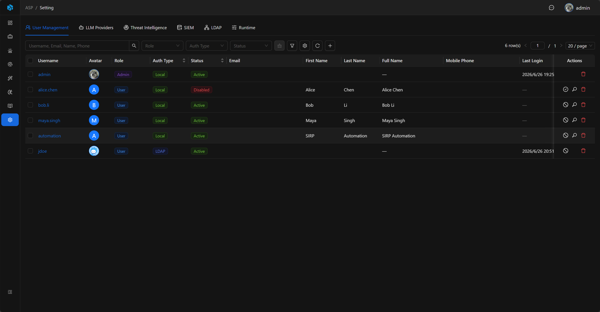
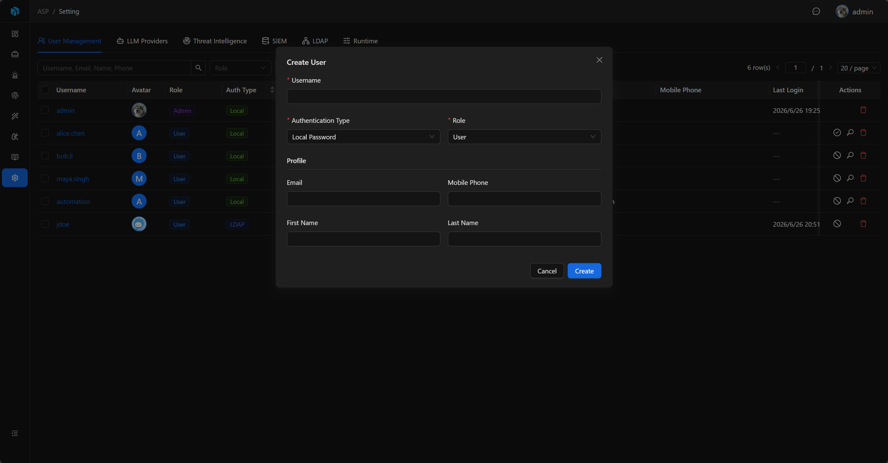

# 用户管理

用户管理用于管理员维护 ASP 用户、角色、认证类型和账号状态。

## 入口

用户管理位于 System Settings 的 `User Management` Tab。只有 admin 可以进入系统设置并调用用户管理接口。



## 用户列表

列表展示 Username、Avatar、Role、Auth Type、Status、Email、Full Name、Mobile Phone、Last Login 和 Date Joined。

列表支持按 Role、Auth Type、Status 快速筛选，也可以按 Username、Email、First Name、Last Name、Mobile Phone、Date Joined、Last Login 等字段高级筛选。

## 用户角色

| 角色     | 来源               | 说明             |
|--------|------------------|----------------|
| admin  | Django superuser | 可进入系统设置并管理配置。  |
| user   | user 组或默认角色      | 可创建、更新、删除业务资源。 |
| viewer | viewer 组         | 只读用户，只能查看资源。   |

当前界面创建和编辑用户时只能分配 `user` 或 `viewer`；`admin` 来自 Django superuser，不通过用户管理界面创建。

## 管理员账号

ASP 的管理员是 Django superuser，需要在后端命令行创建和维护。

创建管理员：

```powershell
cd backend
.\.venv\Scripts\python.exe manage.py createsuperuser
```

创建出的管理员使用登录页的 `Platform` 方式登录。

如果忘记管理员用户名，可以查询现有 superuser：

```powershell
cd backend
.\.venv\Scripts\python.exe manage.py shell -c "from apps.accounts.models import User; print('\n'.join(User.objects.filter(is_superuser=True).values_list('username', flat=True)))"
```

如果需要重置管理员密码：

```powershell
cd backend
.\.venv\Scripts\python.exe manage.py changepassword <admin-username>
```

## 认证类型

| 类型             | 说明                            |
|----------------|-------------------------------|
| Local Password | 使用平台本地密码登录。                   |
| LDAP           | 使用 LDAP 密码登录，前提是 LDAP 已配置并启用。 |

新建 Local 用户时，系统会生成初始密码并显示一段可复制的账号信息。LDAP 用户不会生成本地密码，登录时使用 LDAP 密码。



## 常见操作

- 创建 `user` 或 `viewer` 用户。
- 编辑邮箱、姓名、手机号和角色。
- 启用或禁用非 admin 用户。
- 为 Local 用户重置密码。
- 修改用户头像。

用户管理接口位于 `/api/auth/users/`。
