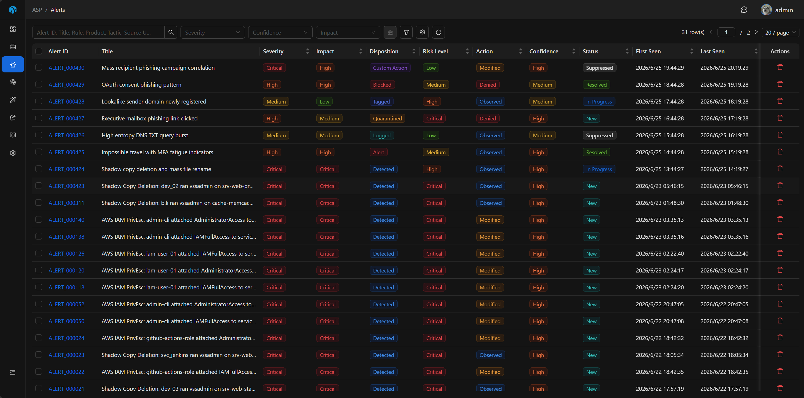
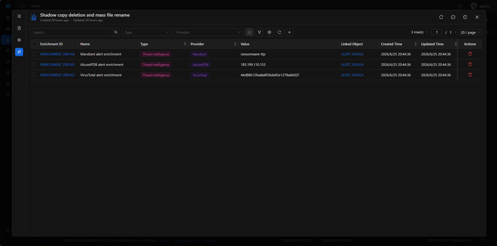
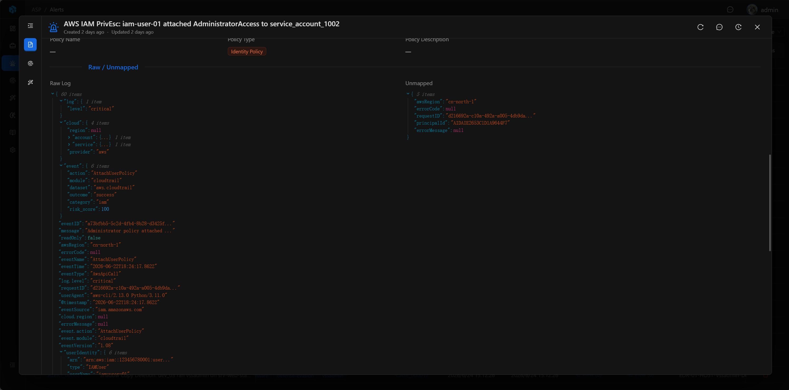

# Alert

Alert 是来自 SIEM、EDR、云平台或 Webhook 的告警记录。它是 Case 的证据层和检测上下文层，用来保留告警来源、规则、产品、MITRE、原始日志和提取出的 Artifact。

Alert 通常不作为最终处置对象单独闭环。分析师基于 Alert 调查和响应，但最终判断、协作讨论、结案摘要和处置决策应回到 Case 中完成。

## View

Alert 列表集中展示所有告警记录，支持按严重性、置信度、影响等快速筛选，也支持按规则、产品、标签、来源 ID、时间等高级条件检索。

## 关键字段

- Alert ID：系统生成的可读 ID。
- Case：关联案件。
- Title：告警标题。
- Severity、Confidence、Impact、Risk Level：风险信息。
- Disposition、Action、Status：告警源和处置状态。
- Rule ID、Rule Name、Correlation UID、Source UID：来源和关联信息。
- Product Vendor、Product Name、Product Feature：来源产品。
- Tactic、Technique、Sub-technique：MITRE 映射。
- Raw Data、Unmapped：原始数据和未映射字段。

## Basic

Basic 展示 Alert 的核心信息：标题、风险评估、检测描述、来源规则、产品信息、MITRE 映射和处置状态。

默认情况下，Alert 字段用于呈现来源系统和检测规则给出的事实信息。分析师通常不会直接修改告警数据，而是基于告警内容进入 Case 完成判断和响应。

## Artifacts

Artifacts 展示从 Alert 中提取或关联的实体和 IOC，例如 IP、域名、账号、主机、文件哈希等。它们是后续威胁情报查询、资产核查、封禁和范围判定的基础。

## Enrichments

Enrichments 展示与 Alert 关联的富化结果，例如威胁情报、声誉、资产、身份、历史记录等外部上下文。

## Raw Log & Unmapped Data

Raw Log 是告警的原始日志内容，通常以 JSON 保存。它用于追溯告警来源、核对字段映射、定位原始事件和排查误报。

Unmapped Data 保存原始告警中未映射到标准字段的数据。它保留了来源系统的额外信息，但默认不是 AI 分析的重点。

## 使用建议

- 从 Case 进入关联 Alert，查看检测上下文和原始证据。
- 通过 Rule ID、Rule Name、Source UID 和 Correlation UID 回到来源系统定位告警。
- 查看 Artifacts 判断涉及哪些实体和 IOC。
- 查看 Raw Log / Unmapped Data 验证字段映射是否完整。

