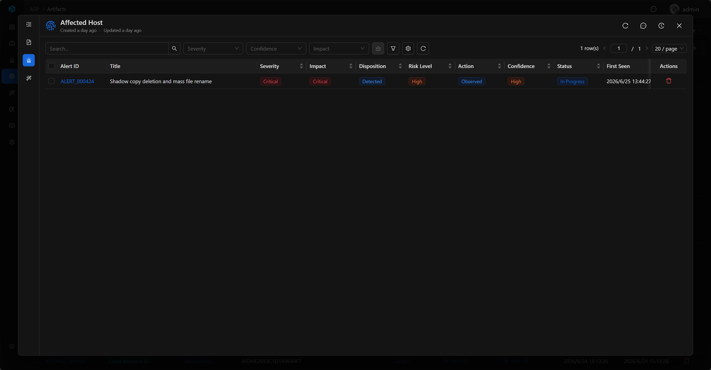
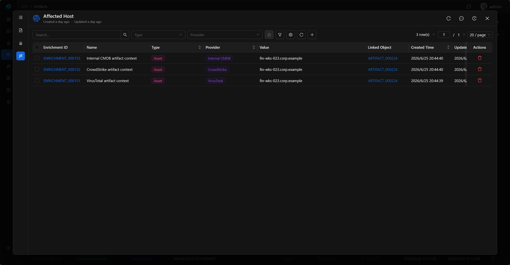

# Artifact

Artifact 表示安全事件中的实体、证据项或 IOC，例如 IP、域名、URL、文件哈希、账号、主机、进程、注册表项、云资源等。

在调查过程中，很多查询、响应和富化动作都会围绕 Artifact 展开：例如查询某个主机的 Owner、查询某个文件哈希的威胁情报、确认某个 IP 是否需要封禁。Artifact 是把“告警里的字段”变成“可调查对象”的关键层。

## View

Artifact 列表用于集中查看已提取的实体和 IOC。列表展示 Artifact ID、Name、Type、Value、Role、Alerts、Enrichments、Created Time 和 Updated Time，分析师可以快速看到实体本身、事件角色以及关联上下文数量。

列表支持按 Type、Role 快速筛选，也可以通过高级筛选按 Artifact ID、Type、Role、Name、Value、Created Time、Updated Time 定位记录。

## 关键字段

- Artifact ID：系统生成的可读 ID。
- Name：实体名称。
- Type：实体类型。
- Role：在事件中的角色，例如 Target、Actor、Affected、Related。
- Value：实体值。

## Basic

Name 会用于列表和详情弹窗标题，帮助快速识别当前实体。Basic 展示 Artifact ID、Type、Role 和 Value：Type 表示实体类型，Role 表示它在事件中的角色，Value 是真正用于查询、响应和富化的实体值。

## 关联关系

Artifact 可以关联多个 Alert，也可以拥有多个 Enrichment。

## Alerts

Alerts 展示与当前 Artifact 关联的告警。分析师可以通过这里反查同一实体出现在哪些告警中，再进入 Alert 详情查看检测规则、原始日志和所属 Case。

## Enrichments

Enrichments 展示围绕 Artifact 生成的外部上下文，例如威胁情报、声誉、资产、身份、历史记录、漏洞信息等。

这些富化结果可以帮助分析师判断一个实体是否恶意、是否属于内部资产、是否已经在其他事件中出现过，以及下一步应该如何响应。分析师也可以在 Enrichments 中新增富化记录，把威胁情报、资产、身份或调查结论挂到当前 Artifact。

## 使用建议

- 从 Alert 详情进入相关 Artifact。
- 对关键 IOC 查看威胁情报富化结果。
- 通过 Artifact 反查涉及同一实体的告警。
- 从 Alerts 和 Enrichments 反查实体的来源告警与外部上下文。
- 对主机、账号、IP、文件哈希等关键实体优先补充资产或威胁情报上下文。
- 将响应动作的对象尽量落到具体 Artifact 上，避免只停留在告警描述中。
