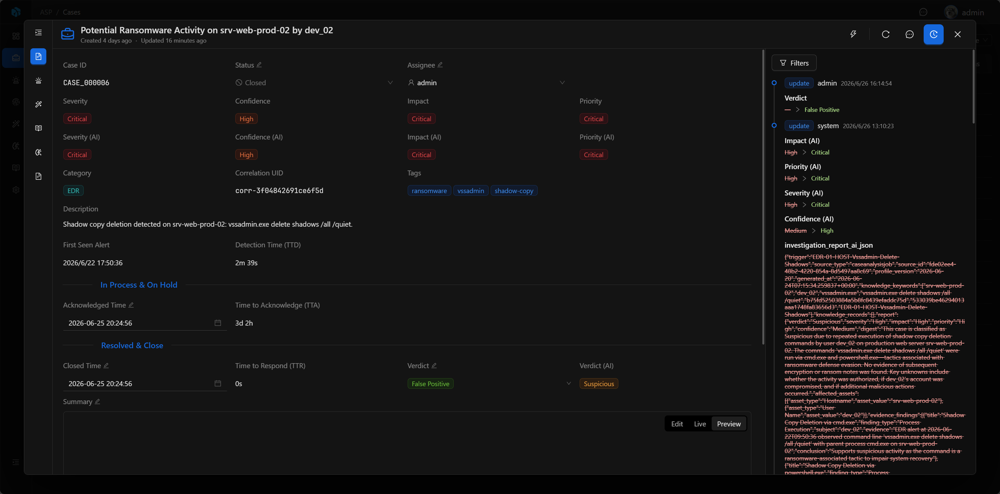

# Audit Log

Audit Log 用于追踪平台内重要资源的变化。它记录谁在什么时候创建、更新、删除了什么，以及具体字段或关联关系发生了哪些变化。

它的重点不是展示资源详情，而是提供一条可回溯的变化时间线，帮助用户理解数据是如何一步步变成当前状态的。

## 入口

Audit Log 通过资源详情页右上角的 `Log` 按钮打开。Case、Alert、Artifact、Enrichment、Playbook、Knowledge 等资源都可以在详情页查看自己的变更时间线。

## 记录内容

| 内容 | 说明 |
| --- | --- |
| Resource | 被操作的资源。 |
| Action | 操作类型，例如 create、update、delete、linked、unlinked、deleted。 |
| Operator | 操作者。系统自动动作会显示为 system。 |
| Time | 操作发生时间。 |
| Changes | 字段变化，包括修改前和修改后的值。 |
| Relation | 资源关联变化，例如关联或解除关联的记录。 |
| Metadata | 额外信息，用于保存关系、标签或删除记录的补充上下文。 |

当前时间线按时间倒序展示最近 100 条记录。

## Timeline View

Audit Log 以时间线方式展示。每条记录包含操作类型、操作者、时间和变化内容，便于快速追踪资源变化过程。

字段更新会以 `from → to` 的方式展示；关联变化会显示相关资源类型和可读标签。对于仍然存在的关联资源，可以直接点击跳转到对应详情页。

## Filters

当记录较多时，可以通过筛选快速定位关键信息：

- Action：按操作类型筛选。
- Operator：按操作者筛选。
- Field：按变化字段筛选。
- Time Range：按时间范围筛选。

## 删除记录

资源被删除时，审计日志会在 metadata 中保留可读标签，避免删除后只能看到 UUID。

如果被删除的是某个关系对象，父资源时间线中会出现 `deleted` 关系事件。由于目标对象已经不存在，这类事件只展示可读标签，不提供跳转。

## 使用建议

- 在 Case、Alert、Artifact 等资源详情中查看变更历史。
- 排查误操作时先查看操作者和 changes。
- 追踪关联关系变化时关注 linked、unlinked、deleted 事件。
- 对已删除记录，优先查看 metadata 中的删除标签。
