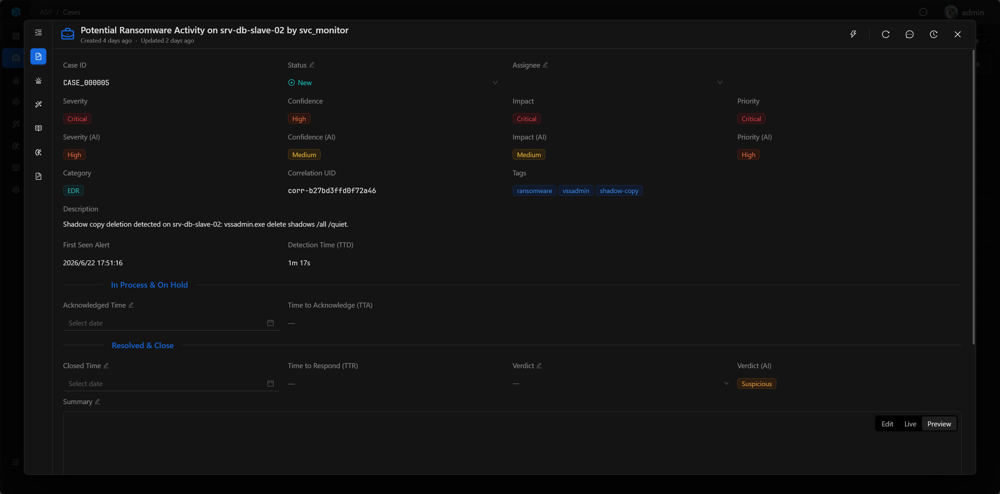
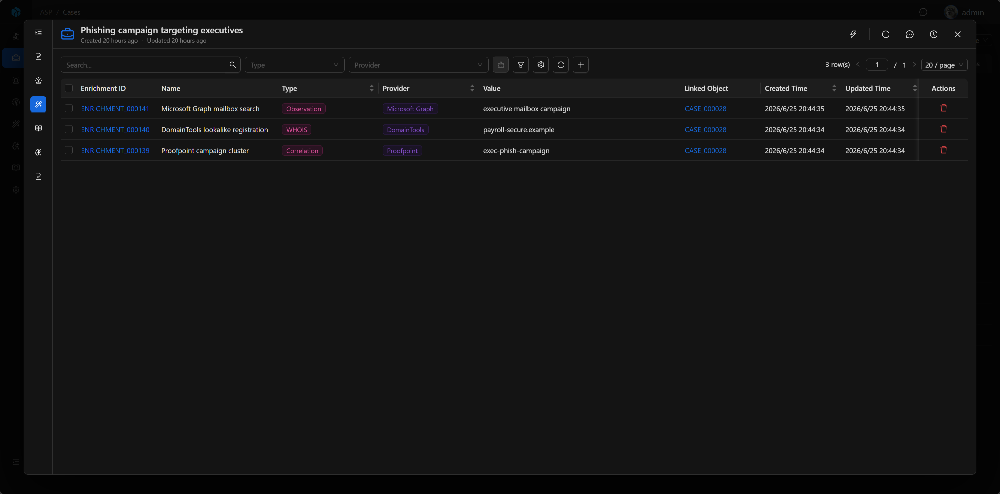
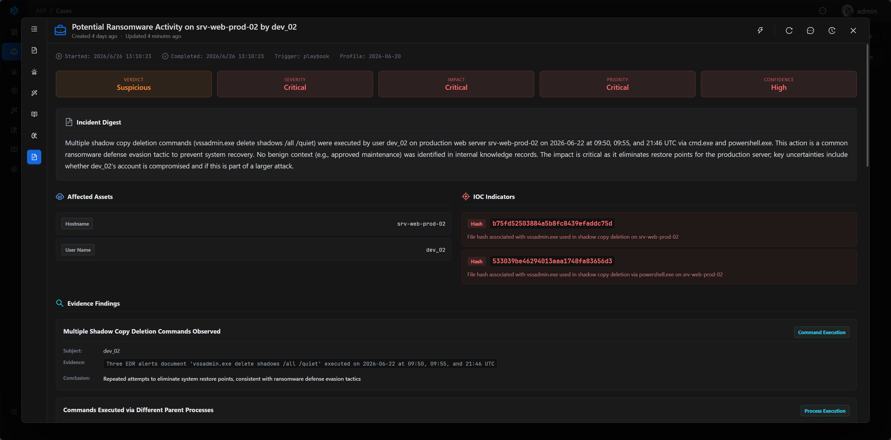
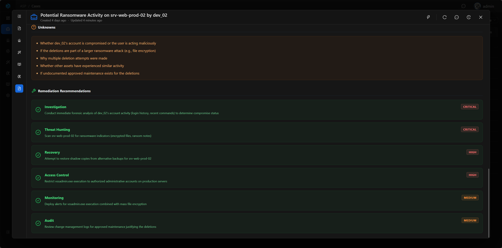
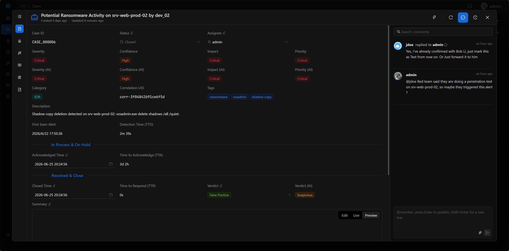
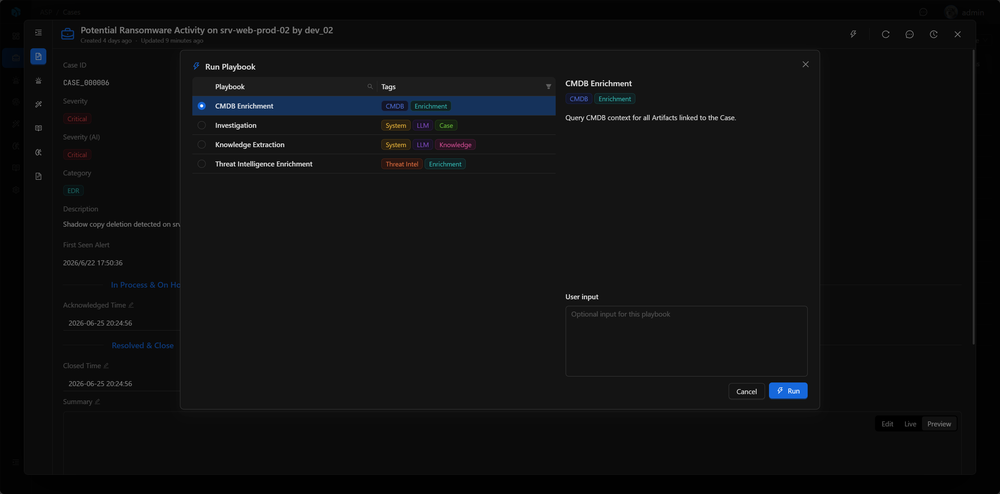

# Case

Case 是 ASP 的核心处置对象，也是分析师协作调查的作战室（War Room）。一个 Case 聚合告警、实体、富化、知识、剧本、AI 调查报告、讨论和时间线，让团队围绕同一个安全事件完成判断和响应。

在 ASP 中，Case 不只是工单。Comments 中的讨论、补充判断和附件，以及 Log / Timeline 中的操作轨迹，都会成为后续 LLM 分析、报告生成和知识提取的重要上下文。

## View

Case 列表用于集中管理和跟踪安全事件处理过程。分析师可以通过状态、严重性、负责人等条件筛选和排序，快速找到需要处置的案件。

## 关键字段

- Case ID：系统生成的可读 ID。
- Title：案件标题。
- Status：New、In Progress、On Hold、Resolved、Closed。
- Severity / Confidence / Impact / Priority：人工评估。
- Severity (AI) / Confidence (AI) / Impact (AI) / Priority (AI)：AI 评估。
- Verdict / Verdict (AI)：最终判定和 AI 判定。
- Assignee：负责人。
- Summary：结案摘要。
- Correlation UID：关联 ID。

## Basic

Case 详情页是案件作战室的主界面。左侧展示案件基本信息、关联证据、自动化结果和 AI 报告；右侧可以打开 Comments 或 Log 抽屉查看协作讨论和时间线。

## 关联证据与上下文

Case 详情页包含：

- Summary、Risk Assessment、Classification、Time、Ownership、Description。
- Alerts：关联告警。
- Enrichments：关联富化结果。
- Knowledge：从案件提取或关联的知识。
- Playbooks：从案件触发的剧本任务。
- Investigation：AI 调查报告。

### Alerts

Alerts 保留与 Case 关联的所有告警，分析师可以从这里进入 Alert 详情查看检测规则、原始日志、Artifact 和 Enrichment。

### Enrichments

Enrichments 展示 Case 关联的威胁情报、资产、身份、历史记录等外部上下文，帮助分析师快速判断风险。

### Playbooks

Playbooks 展示从当前 Case 触发的自动化任务，包括调查、知识提取、威胁情报富化和 CMDB 富化等。

## Investigation

Investigation 展示 AI 生成的调查报告。报告会参考 Case 字段、关联 Alert、Artifact、Enrichment、Comments 和 Log / Timeline，生成判定、攻击链、关键证据、时间线和处置建议。

## Comments

Comments 是 Case 作战室中的协作讨论区。分析师可以记录判断、补充线索、回复队友、@成员并附加文件。

这些讨论不是普通备注。Case 的 LLM 分析会读取 Comments，因此分析师在这里写下的确认、否定、例外和处置记录，会影响后续 AI 报告和知识提取。

## Log / Timeline

Log / Timeline 展示 Case 的操作轨迹，包括字段变化、关联资源变化、操作者和发生时间。它不仅用于审计，也用于还原事件处置过程。

Case 的 AI 分析会参考这类时间线信息，帮助生成更准确的报告和处理过程回顾。

## 执行 Playbook

Case 是 Playbook 的主要触发入口。分析师可以在 Case 中选择调查、知识提取、威胁情报富化或 CMDB 富化等剧本，并通过 User Input 补充自然语言要求。

Playbook 执行后会生成任务记录，状态从 Pending、Running 进入 Success 或 Failed。执行结果会回到 Case、Knowledge 或 Enrichment 中，继续服务后续分析和报告生成。

## 常见操作

- 修改状态、负责人、关闭时间和结案摘要。
- 查看关联 Alert、Artifact 和 Enrichment。
- 在 Comments 中记录分析判断、补充线索和团队讨论。
- 查看 Log / Timeline 还原案件处理过程。
- 从 Case 触发 Playbook，并回到 Case 审查执行结果。

## 下一步

- [Alert](../alert/) — 查看告警如何提供检测上下文。
- [Artifact](../artifact/) — 查看实体和 IOC 如何支撑调查。
- [Playbook](../playbook/) — 查看自动化任务如何从 Case 触发。
- [Audit Log](../audit-log/) — 查看时间线和变更记录的更多说明。
