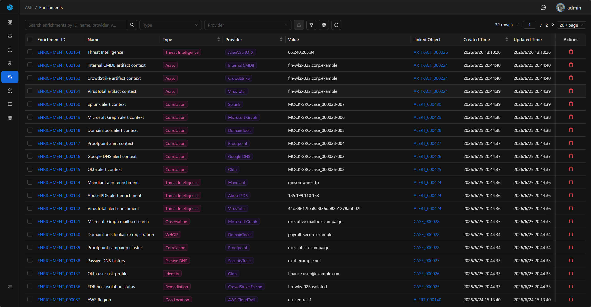
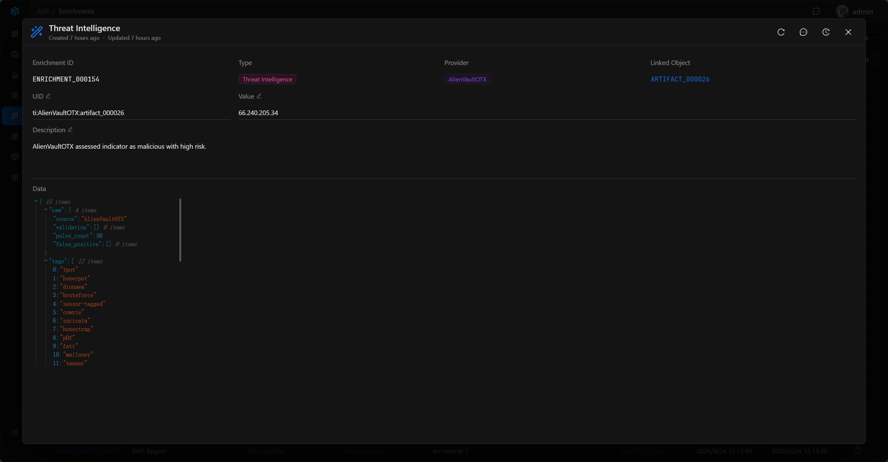

# Enrichment

Enrichment 是附加到 Case、Alert 或 Artifact 的外部上下文，用于保存威胁情报、资产、身份、历史记录、SIEM 查询结果或分析师结构化调查发现。

## View

Enrichment 列表用于集中查看所有富化记录。列表展示 Enrichment ID、Name、Type、Provider、Value、Linked Object、Created Time、Updated Time、Description 和 UID。

列表支持按 Type、Provider 快速筛选，也可以通过高级筛选按 Enrichment ID、Type、Provider、Name、UID、Value、Description、Created Time、Updated Time 定位记录。

## 关键字段

- Enrichment ID：系统生成的可读 ID。
- Name：富化名称。
- Type：富化类型，例如 Threat Intelligence、Reputation、CMDB、Identity、History。
- Provider：数据来源，例如 AlienVaultOTX、Internal CMDB、MCP、Splunk、Elastic。
- UID：外部稳定标识，用于去重。
- Value：富化值。
- Desc：摘要。
- Data：完整 JSON 数据。

## Basic

Basic 展示富化记录的核心信息：Enrichment ID、Type、Provider、Linked Object、UID、Value、Description 和 Data。

Linked Object 表示当前 Enrichment 挂载到哪个 Case、Alert 或 Artifact，点击后可以回到对应资源继续调查。Data 用于保存完整 JSON，适合存放威胁情报返回值、资产详情、身份上下文或 SIEM 查询结果。

## 关联目标

Enrichment 可以关联到：

- Case
- Alert
- Artifact

一条 Enrichment 只关联一个目标对象。Case、Alert 和 Artifact 的详情页都可以通过 Enrichments 查看自身关联的富化上下文。

## 新增与编辑

分析师可以在 Case、Alert 或 Artifact 详情页的 Enrichments 中新增富化记录。手动新增的记录 Provider 为 `MANUAL`，可填写 Type、Name、UID、Value 和 Description。

Enrichment 详情页支持编辑 UID、Value 和 Description，适合在调查过程中补充稳定标识、关键值和摘要说明。

## 使用建议

- 将 IOC 威胁情报结果挂到对应 Artifact。
- 将资产、身份、CMDB 或历史上下文挂到相关 Case、Alert 或 Artifact。
- 将 SIEM 查询结果、人工判断和结构化调查发现保存为 Enrichment，避免只留在临时对话或备注中。
- 用 UID 保存外部系统的稳定标识，便于去重和回溯来源。
