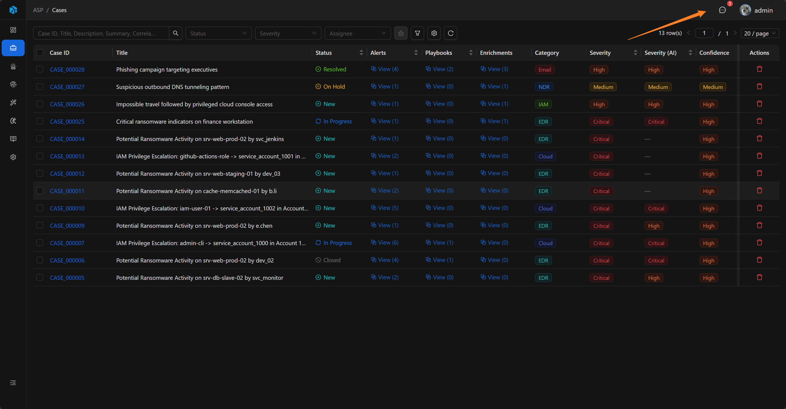
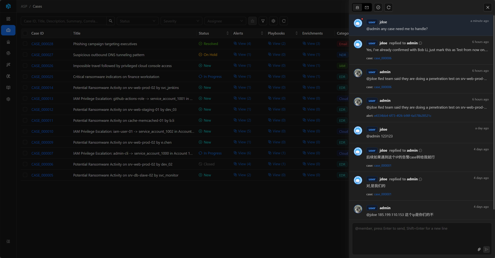
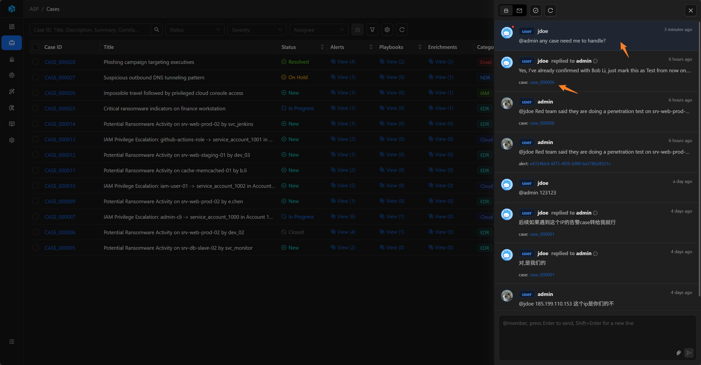

# Inbox

Inbox 是 ASP 的站内消息能力，用于接收系统通知、用户消息和资源相关协作提醒。

## 入口与列表

前端顶部消息按钮会显示未读数量，点击后打开 Inbox Drawer。

Inbox 支持查看全部消息或只看未读消息，也可以刷新列表、Mark all read。点击消息会加载详情，并把当前用户的收件状态标记为已读。

## 消息类型

- System：系统消息。
- User：用户消息。

每个收件人都有独立的已读状态，因此同一条消息对不同用户可以是不同的 read / unread 状态。

## 消息内容

消息会展示发送人、发送时间、消息类型、正文、附件和关联资源。图片附件可以预览，其他文件可以打开或下载。

如果消息关联了资源，Inbox 会显示资源类型和资源标签，点击后可以打开对应详情页继续处理。

## 发送与回复

发送 User 消息时，需要在正文中 `@` 至少一个用户作为收件人，也可以附加文件或粘贴图片。

User 消息支持回复；System 消息不能回复。用户只能删除自己发送的 User 消息，不能删除 System 消息或他人消息。

## 关联资源

Inbox 消息可以关联以下资源：

- Case
- Alert
- Artifact
- Enrichment
- Playbook
- Knowledge
- User

Comments 中 `@` 用户会生成 Inbox 消息，并关联当前资源。用户从这类消息回复时，回复内容也会同步写回对应资源的 Comments。

## 常见用途

- 通知用户关注某个 Case、Alert 或 Artifact。
- 发送系统处理结果。
- 围绕安全资源进行轻量协作。
- 从评论中的 @ 提及进入对应资源继续处理。
