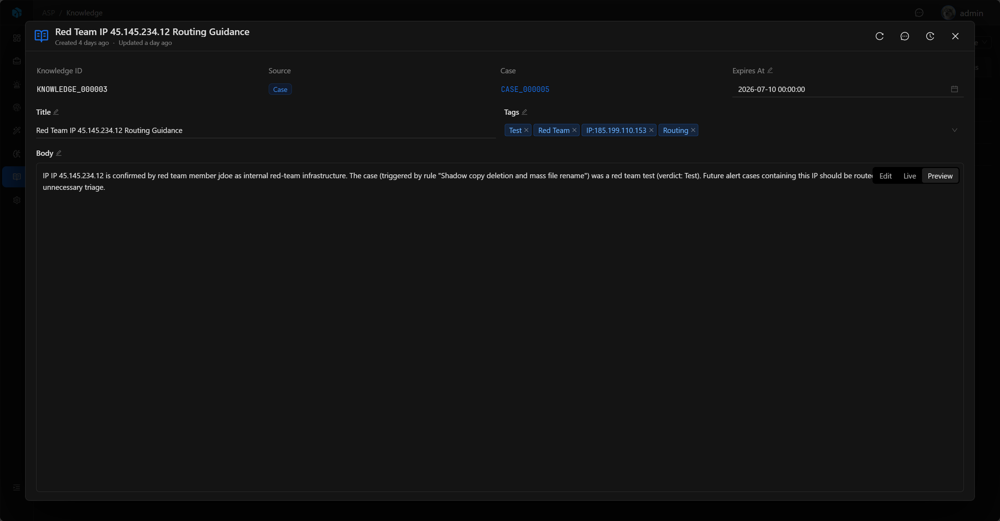
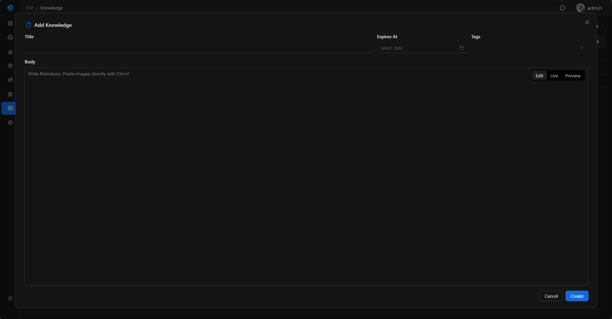

# Knowledge

Knowledge 用于沉淀可复用的安全经验，让团队把处置结论、误报判断、调查步骤和 IOC 研判经验保存为可搜索、可复用的知识。

## View

Knowledge 列表用于集中管理知识条目。列表展示 Knowledge ID、Title、Source、Case、Tags、Expires At、Created Time、Updated Time 和 Body。

列表支持按 Source、Tags 快速筛选，也可以通过高级筛选按 Knowledge ID、Source、Tags、Title、Body、Expires At、Created Time、Updated Time 定位记录。

## 来源

当前支持两类来源：

| 来源     | 说明            |
|--------|---------------|
| Manual | 手动创建的知识。      |
| Case   | 从 Case 提取的知识。 |

Case 来源的 Knowledge 必须关联一个 Case；Manual 来源的 Knowledge 不关联 Case。一个 Case 最多对应一条提取出的 Knowledge。

## 关键字段

- Knowledge ID：系统生成的可读 ID。
- Title：标题。
- Body：正文，支持 Markdown。
- Source：来源。
- Tags：标签。
- Expires At：过期时间，空表示长期有效；过期后不再参与知识搜索和 AI Agent 检索。

## Basic

Basic 展示知识条目的核心信息：Knowledge ID、Source、Case、Expires At、Title、Tags 和 Body。

Case 来源的 Knowledge 会显示来源 Case，点击后可以回到对应 Case 查看调查上下文。Body 使用 Markdown 展示，适合保存结构化分析步骤、判断依据和响应建议。

## 新增与编辑

分析师可以在 Knowledge 列表中手动新增知识，填写 Title、Expires At、Tags 和 Body。手动创建的知识 Source 为 `Manual`。

详情页支持编辑 Title、Expires At、Tags 和 Body。Case 来源的 Knowledge 通常由 `Knowledge Extraction` Playbook 生成，也可以在详情页继续整理内容。

## Knowledge Extraction

`Knowledge Extraction` Playbook 会从已有 analyst verdict 的 Case 中提取可复用知识。执行时会读取 Case 调查上下文，生成标题、正文和标签，并保存为来源为 `Case` 的 Knowledge。

如果 Case 没有 verdict，Playbook 会跳过提取，避免把尚未确认的调查过程沉淀为组织知识。

## 使用建议

- 将重复出现的处置经验写入 Knowledge。
- 关闭关键 Case 后，通过 Playbook 提取知识。
- 将误报判断、调查步骤、IOC 研判经验和响应建议沉淀为可搜索内容。
- 使用 Tags 对攻击类型、业务系统、数据源或响应动作分类。
- 为短期有效的情报或临时处置经验设置 Expires At。
- 在后续调查中参考相似经验。
