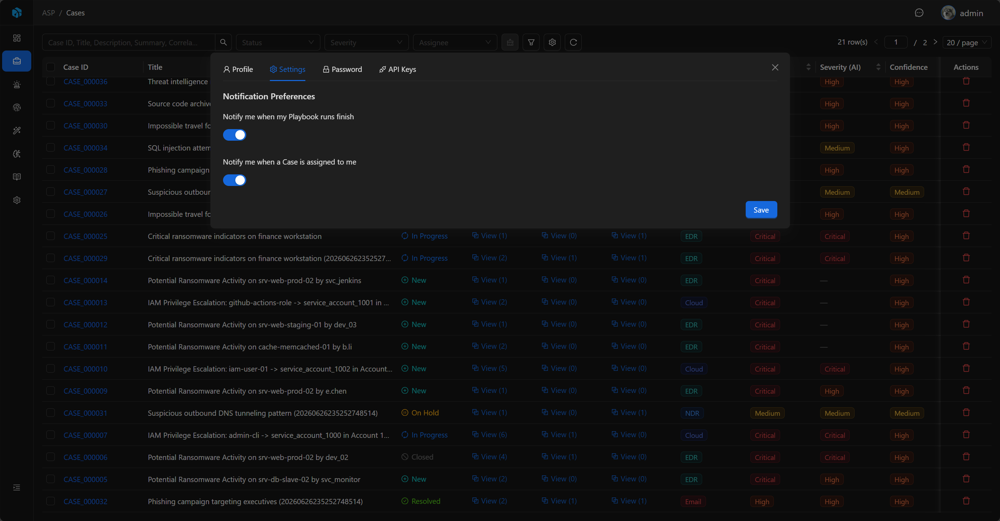
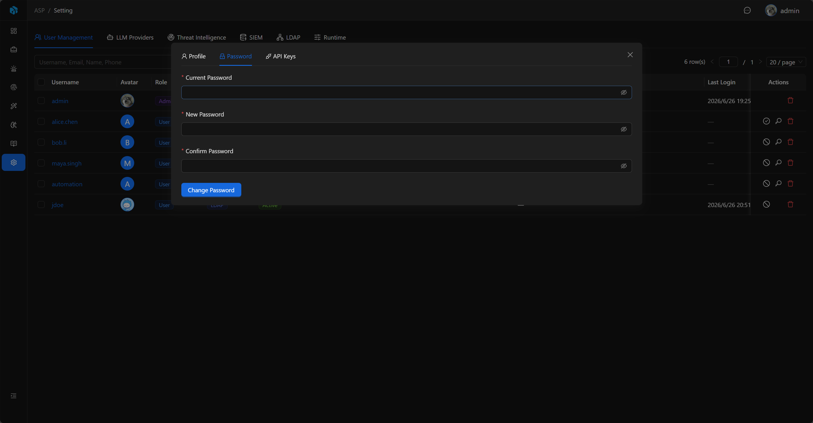
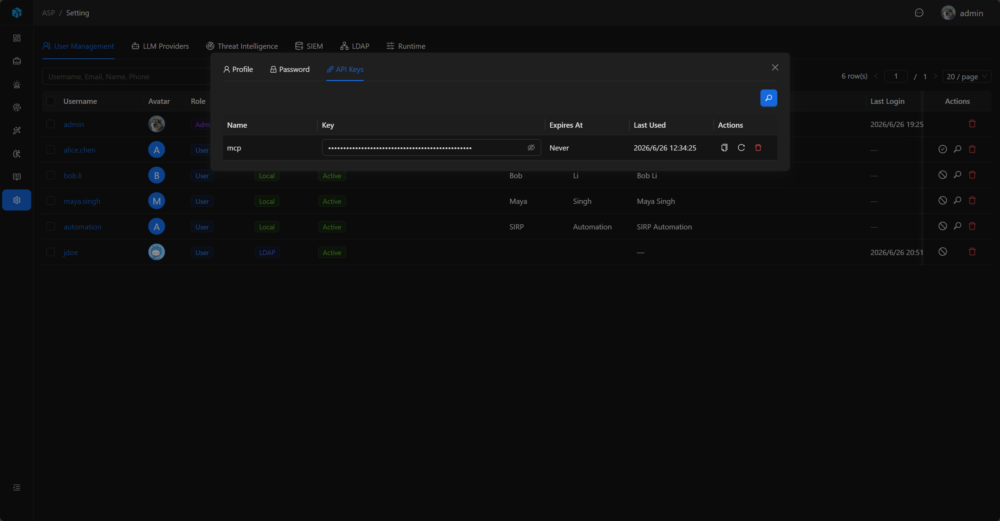

# 个人中心

个人中心用于当前登录用户维护自己的资料、个人设置、密码和 API Key。

## 入口

点击前端右上角用户菜单可以打开个人中心。所有已登录用户都可以进入个人中心。


## Profile

Profile 用于维护当前用户的个人资料：

- Avatar
- Email
- First Name
- Last Name
- Mobile Phone

这些字段只影响当前用户资料，不改变用户角色和认证类型。

## Settings

Settings 用于维护当前用户的个人设置。当前包含 Notification Preferences：

- Notify me when my Playbook runs finish：开启后，当前用户触发的 Playbook 运行完成时会收到 Inbox 系统通知。成功和失败都会通知。
- Notify me when a Case is assigned to me：开启后，Case 被分配给当前用户时会收到 Inbox 系统通知。

通知偏好默认开启。关闭后只影响当前用户本人，不影响其他用户接收通知。

Case 分配通知只会发送给新的负责人。取消分配、重复保存同一负责人，以及用户将 Case 分配给自己时不会发送通知。



## Password

Local Password 用户可以在个人中心修改自己的密码。LDAP 用户使用 LDAP 密码登录，因此不会显示本地密码修改页。



## API Keys

API Key 用于外部脚本、工具或 Agent 调用 ASP API。每个用户只能管理自己的 API Key。

API Key 支持：

- Name：密钥名称。
- Key：以 `asp_` 开头的密钥值。
- Expires At：过期时间，空表示不过期。
- Last Used：最后使用时间。
- Refresh：刷新密钥值。
- Delete：删除密钥。



使用 API Key 调用接口时，在请求头中加入：

```http
Authorization: Api-Key <key>
```

过期的 API Key 不能继续使用；如果用户被禁用，该用户的 API Key 也不能通过认证。

API Key 接口位于 `/api/auth/api-keys/`。
