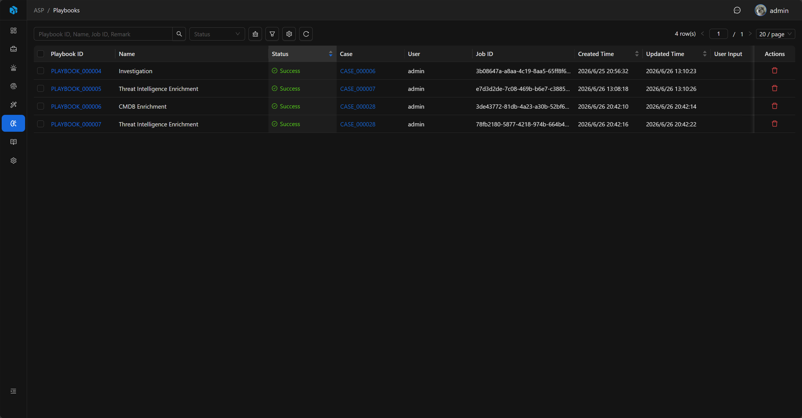
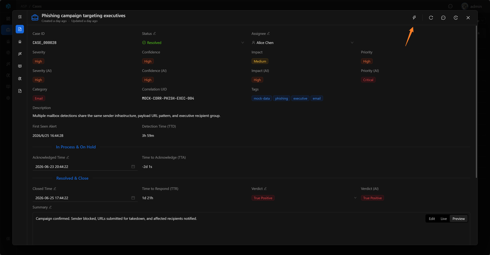
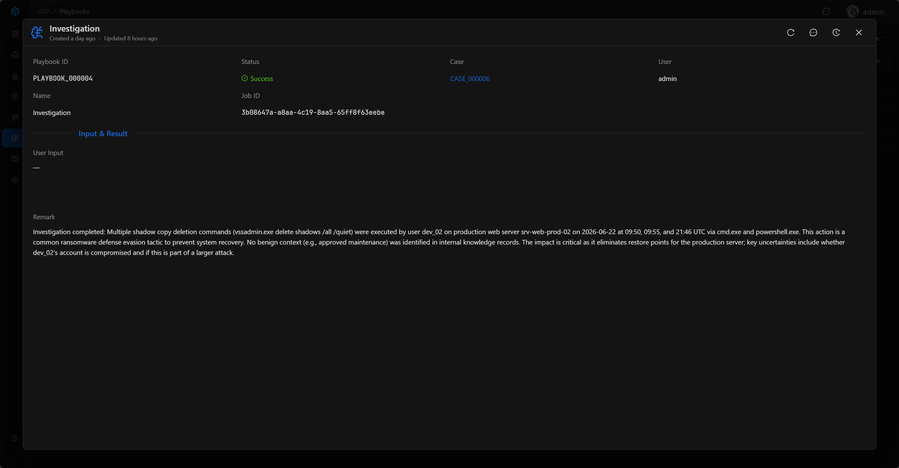

# Playbook

Playbook 是从 Case 触发的自动化任务运行记录，用于执行 AI 调查、知识提取、威胁情报富化、CMDB 富化等用户主动触发的流程。

## View

Playbook 列表用于查看所有任务运行记录。列表展示 Playbook ID、Name、Status、Case、User、Job ID、Created Time、Updated Time、User Input 和 Remark。

列表支持按 Status 快速筛选，也可以通过高级筛选按 Playbook ID、Status、Name、Job ID、User Input、Remark、Created Time、Updated Time 定位记录。



## 关键字段

- Playbook ID：系统生成的可读 ID。
- Case：触发来源。
- Name：执行的剧本名称。
- User Input：初始或追加输入。
- User：请求用户。
- Job Status：Success、Failed、Pending、Running。
- Job ID：后台任务 ID。
- Remark：执行备注。

## Run Playbook

Playbook 从 Case 详情页触发。打开 Case 后，点击右上角的 Run Playbook 按钮。



在弹窗中选择需要执行的 Playbook。列表展示 Playbook 名称、标签和说明，支持按名称、说明或标签搜索。

如果有额外要求，可以在 User Input 中用自然语言补充。执行 Investigation、Knowledge Extraction 等 LLM 相关 Playbook 时，User Input 会作为额外上下文参与分析。



提交后会创建一条 Playbook 运行记录，初始状态为 `Pending`。


## Basic

Playbook 详情页展示 Playbook ID、Status、Case、User、Name、Job ID，以及 Input & Result 中的 User Input 和 Remark。

Case 字段可以跳转回触发来源。Remark 用于记录执行摘要或失败原因。


## 状态流转

Playbook 的状态按以下流程变化：

```text
Pending → Running → Success / Failed
```

`Pending` 表示任务已提交，等待后台调度；`Running` 表示正在执行；`Success` 和 `Failed` 是终态。

执行完成后，点击任务记录可以查看执行详情。

## 当前内置方向

当前后端包含以下 Playbook 示例：

- Investigation：案件调查。
- Knowledge Extraction：从已有 analyst verdict 的 Case 中提取可复用知识。
- Threat Intelligence Enrichment：为 Case 关联 Artifact 查询威胁情报并写入 Enrichment。
- CMDB Enrichment：为 Case 关联 Artifact 查询资产上下文并写入 Enrichment。

Playbook 的输出应写回 Case、Knowledge 或 Enrichment，而不是停留在临时日志中。

## 使用建议

- 从 Case 触发 Playbook，不直接从 Alert 或 Artifact 触发。
- 对需要 AI 调查报告的案件执行 Investigation。
- 在 Case 有明确 verdict 后执行 Knowledge Extraction，沉淀可复用知识。
- 对涉及 IOC、主机、账号等实体的案件执行威胁情报或 CMDB 富化。
- 执行后回到 Case、Knowledge 或 Enrichment 审查结果，不只查看 Playbook 记录本身。
