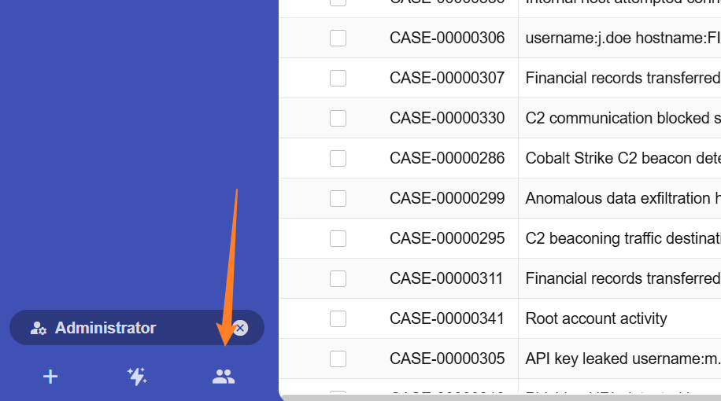
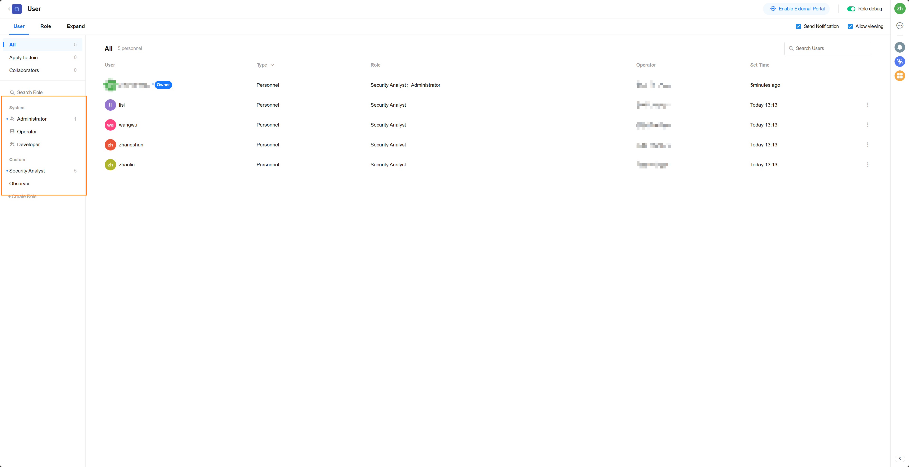
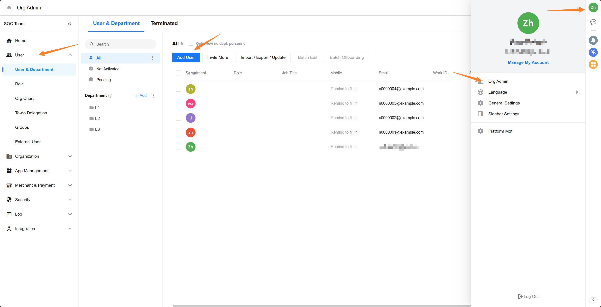
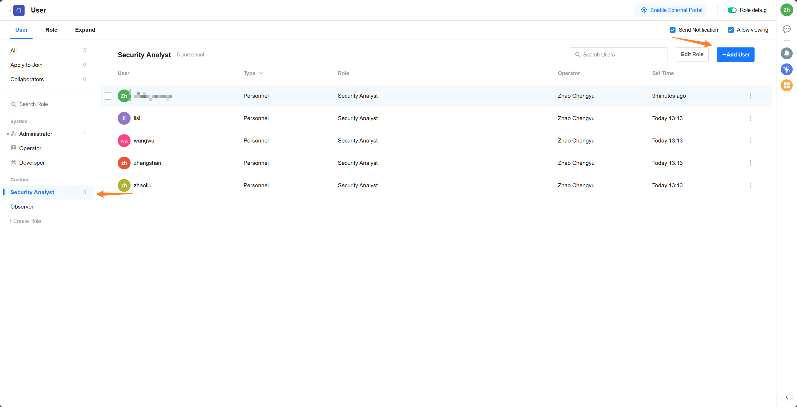

# 配置应用

## 角色管理

SIRP 内置 `Administrator`、`Security Analyst`、`Observer` 三种角色，用户可以根据实际需求创建自定义角色并分配权限。

- Administrator

拥有系统的全部权限

- Security Analyst

拥有数据的查看和操作权限，但没有系统配置权限，日常分析人员和应急响应人员可分配此角色

- Observer

仅拥有数据查看权限，适合管理层和审计人员

## 账号管理

### 添加账号

管理员可以通过`组织管理`、`用户和部门`添加新的用户账号。

用户加入到组织后，可以在 SIRP 中将用户分配到不同的角色。

