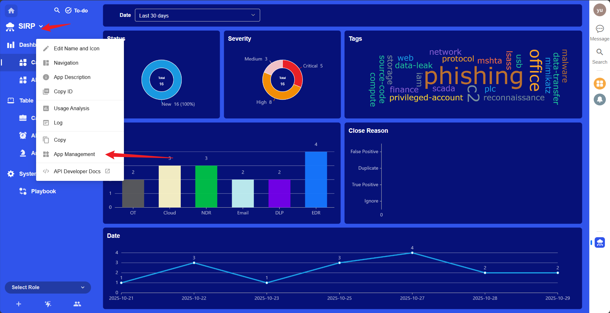
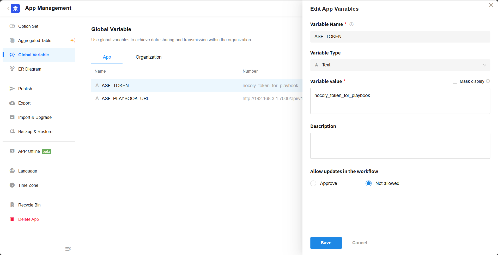

# SIRP 安装

SIRP 基于 Nocoly 平台进行部署。Nocoly 可以私有部署或使用云服务。

## Nocoly 私有部署 VS 云服务

- **Nocoly 云服务：** 适合快速体验和小规模验证。
    - 无需自行维护服务器和环境。
    - 数据存储在 Nocoly 云端。
    - 免费版存在功能限制。

- **Nocoly 私有部署：** 适合生产环境部署及使用大规模测试。
    - 最低配置要求：8 核 CPU、32GB 内存、50GB 硬盘。
    - 数据存储在本地服务器。
    - 私有部署可免费使用专业版功能。

详细对比请参考：https://www.nocoly.com/pricing

## 安装 Nocoly（私有部署）

参考[官方安装手册](https://docs-pd.nocoly.com/zh-Hans/deployment/docker-compose/standalone/quickstart/)

### 常见问题

- `DockerCgroupDrive`问题

  https://docs-pd.nocoly.com/deployment/env/?_highlight=dockercgroupdrive#dockercgroupdrive

- `ERROR: client version 1.25 is too old. Minimum supported API version is 1.44, please upgrade your client to a newer version`报错

  修改`service.sh`脚本，将所有 XXX\docker-compose 修改为 docker compose（使用系统 docker compose 启动）

## 注册 Nocoly 账号（云服务）

访问 Nocoly 官网并注册 https://www.nocoly.com/

## 下载 SIRP 应用

- 克隆 ASP 代码库

```bash
git clone git@github.com:FunnyWolf/agentic-soc-platform.git
```

- SIRP 应用文件为 agentic-soc-platform/Docker/SIRP/SIRP.mdy

## 安装 SIRP 应用（云服务）

> 免费版不支持应用升级

- 登录 Nocoly 平台选择 `应用` -> `新建应用` -> `导入`，选择 SIRP.mdy 文件进行导入。


## 导入 SIRP 应用（私有部署）

> 私有部署专业版免费,支持应用升级

- 登录 Nocoly 私有部署地址，选择 `组织管理` -> `应用`，选择 SIRP.mdy 文件进行导入。


- 支持应用升级






## 打开 SIRP 应用

- 导入完成后，点击 `SIRP` 打开应用。


