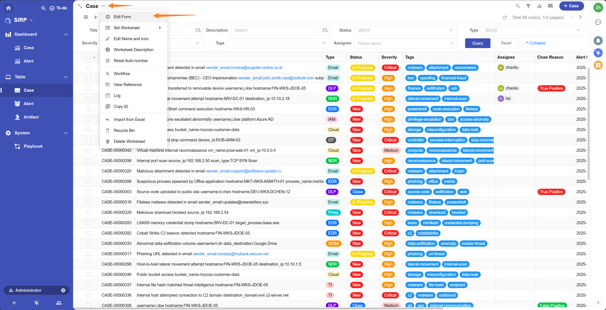
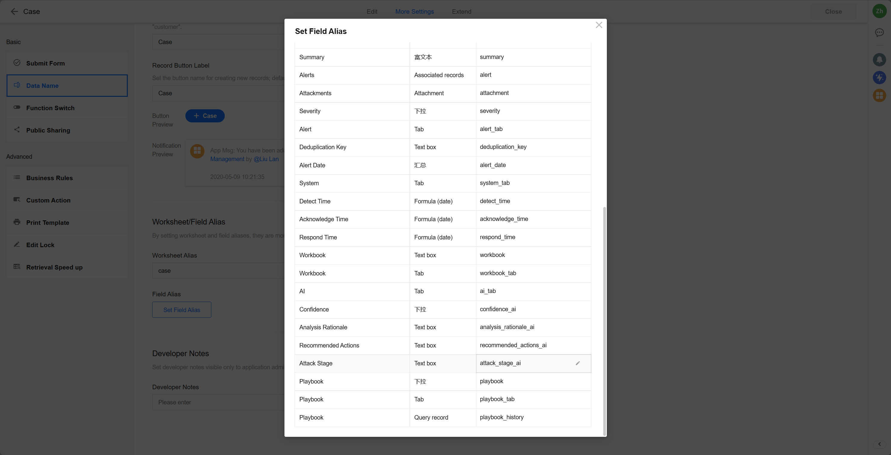

# 自定义字段

- 添加字段到表单

- 设置字段别名

- 修改 XXXModel

  https://github.com/FunnyWolf/agentic-soc-platform/blob/master/PLUGINS/SIRP/sirpcoremodel.py
  https://github.com/FunnyWolf/agentic-soc-platform/blob/master/PLUGINS/SIRP/sirpextramodel.py